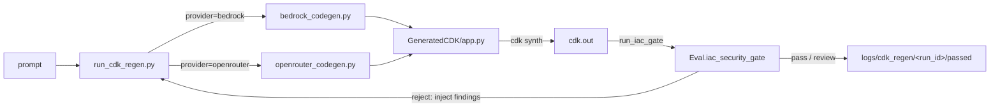

# AIgen — Zone 1 Code Generation

## Purpose

`AIgen/` is the **Zone 1** entry point in the SysSecOps model: it generates synthesizable
AWS CDK (Python) code from a natural-language prompt, then drives the
**generate → synth → gate → regenerate** feedback loop. Gate findings are injected back into
the next prompt so the model remediates its own security issues.

## Files

| File | Role |
|---|---|
| `bedrock_codegen.py` | AWS Bedrock generation backend (Qwen 3 Coder 30B) |
| `openrouter_codegen.py` | OpenRouter generation backend (HTTP); drop-in alternative to Bedrock |
| `run_cdk_regen.py` | CDK regen loop: generate → synth → gate → retry on reject |



---

## `bedrock_codegen.py` — Bedrock Backend

Generates Python code via the Bedrock runtime. Output is plain Python prefixed with an
`# INSTRUCTIONS: … # END INSTRUCTIONS` block.

| Function | Purpose |
|---|---|
| `build_user_prompt(user_request)` | Wraps the request with structured requirements |
| `extract_instructions(code_text)` | Pulls the instruction block out of generated code |
| `extract_code(raw_text)` | Strips markdown fences → pure Python |
| `call_bedrock(user_request, model_id, region=None, max_tokens=1400)` | Raw generation call |
| `validate_model_id(model_id, region=None)` | Raises `ValueError` if the model is unavailable |
| `is_quota_throttling_error(exc)` / `format_bedrock_error(exc)` | Throttle detection / error formatting |
| `save_code(code, output_path)` | Writes `.py` + `.instructions.txt` |
| `generate_and_save(...)` / `parse_args()` / `main()` | End-to-end + CLI |

- **Env:** `BEDROCK_MODEL_ID` (default `qwen.qwen3-coder-30b-a3b-v1:0`), `AWS_REGION`.
- **Deps:** `boto3` (`bedrock-runtime`).

---

## `openrouter_codegen.py` — OpenRouter Backend

Same generation contract as Bedrock, but over HTTP to the OpenRouter API. Used when direct
Bedrock access is unavailable.

| Function | Purpose |
|---|---|
| `call_openrouter(user_request, model_id, api_key, api_url=…, max_tokens=2400, temperature=0.2, …)` | HTTP generation call |
| `build_user_prompt` / `extract_instructions` / `extract_code` | Shared prompt + parsing helpers |
| `is_quota_throttling_message(text)` / `format_openrouter_http_error(status, details)` | Error handling |
| `save_code` / `generate_and_save` / `parse_args` / `main` | End-to-end + CLI |

- **Env:** `OPENROUTER_API_KEY` (required), `OPENROUTER_MODEL_ID`
  (default `qwen/qwen3-coder-30b-a3b-instruct`), `OPENROUTER_API_URL`, optional
  `OPENROUTER_APP_NAME` / `OPENROUTER_APP_URL`.
- **Deps:** `urllib`, `env_bootstrap.load_env()`.

---

## Provider Configuration

- Bedrock uses `AWS_ACCESS_KEY_ID`, `AWS_SECRET_ACCESS_KEY`, `AWS_REGION`.
- OpenRouter uses `OPENROUTER_API_KEY` (or `--api-key`).
- Never hardcode credentials — they are read from the environment or `.env`.

## Outputs

- Standalone generation writes `<output_path>.py` + `<output_path>.instructions.txt`.
- The CDK regen loop writes generated code to `GeneratedCDK/app.py` and per-attempt
  artifacts to `logs/cdk_regen/<run_id>/attempt_<N>/` (prompt, code, gate report, synth output),
  with the winning/losing attempt copied to `passed/` or `failed/`.

## CDK Regen Loop (`run_cdk_regen.py`)

A CDK-specific generation loop that uses gate findings as structured feedback for regeneration.

```bash
# Standalone — generates, synths, gates, retries on failure
python AIgen/run_cdk_regen.py \
  --prompt "Create an S3 bucket with versioning and encryption" \
  --project-dir GeneratedCDK \
  --max-attempts 5 \
  --provider openrouter \
  --api-key sk-or-...
```

| Option | Description |
|---|---|
| `--prompt` | Infrastructure request |
| `--project-dir` | CDK project directory (default: `GeneratedCDK`) |
| `--max-attempts` | Max regen attempts (default: 2) |
| `--provider` | `bedrock` or `openrouter` |
| `--model-id` | Model ID override |
| `--region` | AWS region (Bedrock) |
| `--api-key` | OpenRouter API key |
| `--run-id` | Override auto-generated run ID |

**Loop behaviour:**
1. Generate code → write to `GeneratedCDK/app.py`
2. Clear `cdk.out/` to remove stale templates from prior runs
3. `cdk synth` — on failure, synth error is cleaned (jsii banner stripped) and injected into next prompt along with the failing code
4. IaC gate — on `reject`, findings are injected into next regen prompt
5. On `pass` or `review`, save to `logs/cdk_regen/<run_id>/passed/` and return success
6. On exhaustion, save to `logs/cdk_regen/<run_id>/failed/` and return failure

**Prompt enforcement:** The generation prompt enforces `EXACTLY ONE Stack class` to prevent multi-stack outputs that inflate the template count in the gate scanner.

The loop can also be triggered from the main CLI pipeline on gate reject:

```bash
python scripts/run_cdk_pipeline.py \
  --project-dir GeneratedCDK \
  --regen-on-reject \
  --max-regen-attempts 3 \
  --prompt "Create an S3 bucket with versioning and encryption"
```

## SysSecOps Alignment

Implemented (Phase 1 + Phase 3):
- Zone 1 generation and feedback loop
- Structured failure feedback for regeneration (synth errors and gate findings)
- CDK regen loop with gate findings injected into the next prompt
- Provider abstraction (Bedrock / OpenRouter)

Not yet fully implemented in this module:
- strict prompt templates dedicated to CDK-only output format
- deterministic generation contract for multi-file CDK apps

See [`../CDK-ONLY-NEXT-STEPS.md`](../CDK-ONLY-NEXT-STEPS.md) for implementation priorities
and [`../THESIS_REPORT.md`](../THESIS_REPORT.md) for the full system context.
