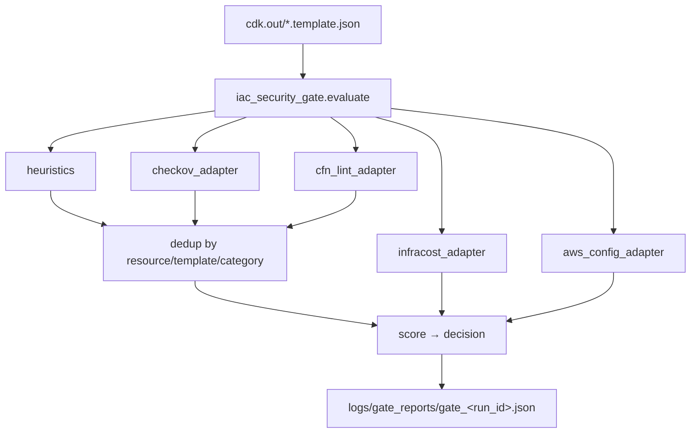

# Eval — Zone 2 Security Gate and Scoring

## Purpose

`Eval/` implements **Zone 2** in the SysSecOps model: it gates CDK deployments by analyzing
the synthesized CloudFormation templates, aggregating findings from four independent
scanners, deduplicating across sources, and producing a single **scored risk decision**
(`pass` / `review` / `reject`).

## Files

| File | Role |
|---|---|
| `iac_security_gate.py` | CDK synth template analyzer + Ansible playbook analyzer + deployment gate scorer |
| `scanners/` | Pluggable scanner adapters (Checkov, cfn-lint, Infracost, AWS Config, ansible-lint, secret-scan) |
| `dependency-check/` | Bundled OWASP Dependency-Check distribution (optional SCA tooling) |

> **Hybrid (on-prem) path:** `IaCSecurityGate.evaluate_ansible()` scores Ansible
> playbooks using `ansible-lint`, Checkov (`--framework ansible`) and a regex
> secret scan, reusing the identical dedup + scoring helpers
> (`_dedupe_findings`, `_score_findings`) as the CloudFormation path — so CDK and
> Ansible decisions use the same severity weights and thresholds. Infracost /
> AWS Config do not apply (cost component is 0). Pass `changed_files=...` to
> scope the scan to git-changed YAML.



## Scanner Adapters (`Eval/scanners/`)

| Adapter | Scanner | Status | Graceful degradation |
|---|---|---|---|
| `checkov_adapter.py` | Checkov | Phase 1 | `not_installed`, `error`, `skipped` |
| `cfn_lint_adapter.py` | cfn-lint | Phase 1 | `not_installed`, `error`, `skipped` |
| `infracost_adapter.py` | Infracost CLI | Phase 2 | `not_installed`, `not_supported`, `error` |
| `aws_config_adapter.py` | AWS Config (boto3) | Phase 2 | `not_installed`, `no_credentials`, `not_configured`, `error` |
| `ansible_lint_adapter.py` | ansible-lint | Hybrid | `not_installed`, `error`, `skipped` |
| `secret_scan_adapter.py` | regex secret scan (no external tool) | Hybrid | `skipped` |

All adapters return a dict with at minimum `{status, message}` plus adapter-specific fields,
and never raise — a missing tool degrades to a `skipped`/`not_installed` status while the
gate still proceeds.

| Adapter | Entry point | Normalization highlights |
|---|---|---|
| `checkov_adapter.py` | `run_checkov(cdk_out_dir, *, enabled=True, template_files=None)` | Per-file scan; maps check IDs → categories (`CKV_AWS_24`→`sg_ssh_open`); strips type prefix from resource IDs |
| `cfn_lint_adapter.py` | `run_cfn_lint(template_files, *, enabled=True)` | Maps rule IDs → categories (`W3045`→`s3_public_acl`); `error`→high, `warning`→medium |
| `infracost_adapter.py` | `run_infracost(cdk_out_dir, *, enabled=True)` | `infracost scan --json`; sums per-project monthly cost |
| `aws_config_adapter.py` | `fetch_violations(region=None, stack_name=None, *, enabled=True, profile_name=None)` | `describe_compliance_by_config_rule(NON_COMPLIANT)`; SSO credential fallback |

## A. IaC Security Gate for CDK

`iac_security_gate.py` analyzes synthesized CloudFormation templates in `cdk.out` and returns a gate report.

### Evaluate signature

```python
gate.evaluate(
    cdk_out_dir,           # Path to cdk.out/
    cost_delta_usd=None,   # None = auto-run Infracost; float = override
    aws_config_violations=None,  # None = auto-fetch via boto3; int = override
    use_checkov=True,
    use_cfn_lint=True,
    use_infracost=True,
    use_aws_config=True,
    run_id=None,           # When set, report is persisted to logs/gate_reports/
    region=None,
    stack_name=None,
)
```

### Gate report structure

```json
{
  "run_id": "cdk_20260614T093934Z",
  "timestamp": "2026-06-14T09:39:42+00:00",
  "score": 90,
  "decision": "reject",
  "message": "Auto-reject. Regenerate IaC or remediate findings.",
  "components": { "severity": 60, "cost": 15, "aws_config": 15 },
  "inputs": {
    "cost_delta_usd": 49.63,
    "cost_delta_override": false,
    "aws_config_violations": 3,
    "aws_config_override": false
  },
  "scanner_status": {
    "checkov": "ok",
    "cfn_lint": "ok",
    "infracost": "ok",
    "aws_config": "no_credentials"
  },
  "scanner_warnings": [],
  "findings": [],
  "cost_analysis": { "status": "ok", "cost_delta_usd": 49.63, "template_count": 4 },
  "config_analysis": { "status": "no_credentials", "violation_count": 0 },
  "report_path": "/path/to/logs/gate_reports/gate_cdk_20260614T093934Z.json"
}
```

### Gate report persistence

Reports are saved automatically to `logs/gate_reports/gate_<run_id>.json` when `run_id` is provided. `save_report()` can also be called directly:

```python
path = gate.save_report(report, run_id="my_run")
```

### Current Rule Coverage in IaC Gate

**Heuristic checks** (`iac_security_gate.py`):
- Security Group public ingress (`0.0.0.0/0`, SSH critical)
- S3 public access block enforcement
- S3 public ACL detection
- IAM policy wildcard action/resource detection
- RDS encryption check
- EBS volume encryption check

**Checkov checks** (`checkov_adapter.py`):
- Runs per-template (`--file <path>`) against the CloudFormation framework
- Category map normalises check IDs (e.g. `CKV_AWS_24` → `sg_ssh_open`) for cross-source deduplication
- Resource IDs have the type prefix stripped (`AWS::EC2::SecurityGroup.LogicalId` → `LogicalId`) to match heuristic findings

**cfn-lint checks** (`cfn_lint_adapter.py`):
- Rule IDs mapped to categories (`W3045` → `s3_public_acl`, etc.)

### Cross-Source Finding Deduplication

All findings carry a `category` field (e.g. `sg_ssh_open`, `s3_public_access_block`). The gate deduplicates across sources by `(resource_id, template, category)`, keeping the highest severity and merging source labels (e.g. `iac_security_gate+checkov`) when multiple scanners report the same issue. This prevents score inflation from the same vulnerability being counted multiple times.

### Scoring and Decisions

- Severity points:
  - `critical`: 20
  - `high`: 10
  - `medium`: 5
  - `low`: 1
- Cost adjustment:
  - `cost_delta_usd > $10`: +5
  - `cost_delta_usd > $50`: +10
- AWS Config adjustment:
  - `aws_config_violations × 5`

Decision thresholds:
- `0–20`: `pass`
- `21–80`: `review`
- `> 80`: `reject`

## Integration with CDK Pipeline

`pipeline/cdk_pipeline.py` uses this module to enforce deploy gating:
1. `clear_cdk_out(project_dir)` — purge stale templates before synth
2. `cdk synth`
3. `run_iac_gate(project_dir, run_id=run_id, region=region)` — auto-runs all scanners; checkov runs per-template file, not directory
4. `cdk diff`
5. `can_deploy(gate_report, manual_review_approved=...)` — final decision

Manual review approval is required for `review` decisions before deploy.

## Override Logic

Cost and AWS Config values follow this priority:
1. Explicit CLI arg / caller param (e.g. `--cost-delta-usd 25.0`) → used directly
2. Auto-detected (Infracost / boto3) → used when no explicit value
3. Graceful degradation → 0.0 / 0 if tool unavailable, gate still proceeds

## SysSecOps Comparison

Implemented (Phase 1 + Phase 2 + Phase 3 + Phase 4):
- risk gate between synth and deploy
- score-based pass/review/reject behavior
- Checkov per-template scan with category mapping and resource ID normalisation
- cfn-lint scanner with category mapping
- Infracost CLI auto-cost analysis
- AWS Config auto-violations fetch via boto3
- cross-source finding deduplication by `(resource_id, template, category)`
- within-heuristic deduplication (one finding per resource per category)
- gate report persistence to `logs/gate_reports/`
- approval records with AWS caller ARN in `logs/approvals/`
- rejection records with top findings in `logs/rejections/`
- SSM Parameter Store gate result persistence (Phase 4)
- EventBridge `GateDecision` event publishing (Phase 4)
- CloudWatch metrics + structured logs after every gate (Phase 4)
- 3-layer post-deploy security monitoring (Phase 4)

See `PHASE4_REPORT.md` for the full Phase 4 implementation details.
