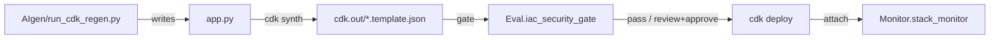

# GeneratedCDK — CDK Deployment Target

## Purpose

`GeneratedCDK/` is the working CDK project that the pipeline synthesizes, gates, and
deploys. The `app.py` here is **rewritten in place** by the code-generation module
(`AIgen/run_cdk_regen.py`) on every generation run — the version checked into the repo is a
minimal reference example (a single encrypted, versioned S3 bucket).

> Treat `app.py` as generated output. Manual edits made in the UI's *Review & Edit* sub-tab
> are also written here before the gate re-runs.

## Files

| File | Role |
|---|---|
| `app.py` | The CDK app (generated/edited). Must contain exactly one `Stack` and call `app.synth()` |
| `cdk.json` | CDK config: `{"app": "../.venv/bin/python app.py"}` |
| `cdk.context.json` | CDK context cache (queried VPC/AMI/AZ values); currently `{}` |
| `requirements.txt` | `aws-cdk-lib>=2.0.0`, `constructs>=10.0.0` |
| `command_logs/` | Archived `cdk synth` output (`synth_<timestamp>.log`) from generation runs |

## Lifecycle



1. `AIgen/run_cdk_regen.py` writes generated code to `app.py`.
2. `pipeline/cdk_pipeline.py::clear_cdk_out()` purges stale templates, then runs `cdk synth`.
3. `Eval/iac_security_gate.py` scores the synthesized templates in `cdk.out/`.
4. If the gate allows it, `cdk deploy` runs and `Monitor/stack_monitor.py` attaches monitoring.

## Generation Contract

Generated `app.py` must:

- declare **exactly one** `Stack` subclass (multi-stack output inflates the template count
  and the gate score);
- call `app.synth()` at module scope;
- contain no `input()` calls at import time or inside `Stack.__init__`;
- use safe, non-interactive defaults (`CfnParameter`, env vars, constructor args).

The generation prompt in `AIgen/run_cdk_regen.py` also enforces least-privilege IAM, default
encryption (S3/RDS/EBS), no public SSH/RDP, and `RemovalPolicy.RETAIN` for stateful resources.

## Setup

```bash
cd GeneratedCDK
pip install -r requirements.txt   # if not already installed in the project venv
cdk synth                          # manual synth (optional)
```

See [`../AIgen/README.md`](../AIgen/README.md) and [`../Eval/README.md`](../Eval/README.md).
