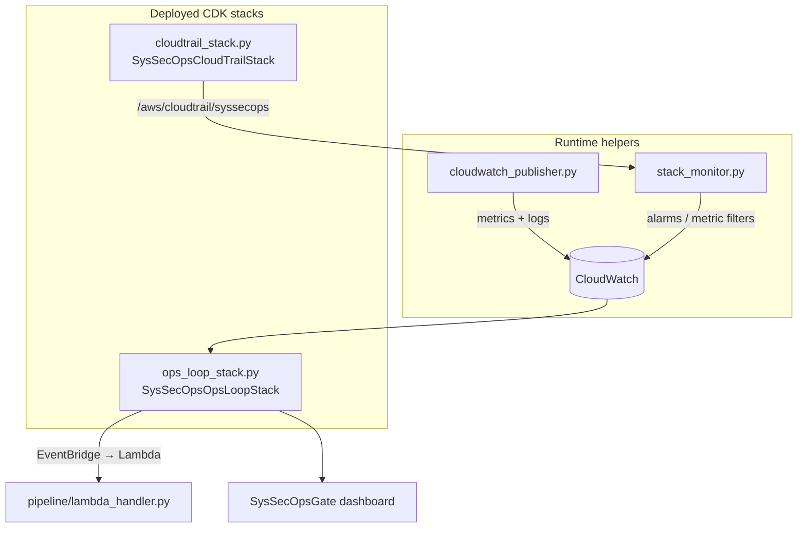

# Monitor — Phase 4 Ops Loop & Observability

## Purpose

`Monitor/` contains the Phase 4 observability and security-monitoring infrastructure. It
provides two deployable CDK stacks (an ops-loop stack and a CloudTrail audit stack) plus
two runtime helpers that publish gate metrics and attach a 3-layer security-monitoring
mesh to every deployed CDK stack.



## Files

| File | Role |
|---|---|
| `__init__.py` | Package marker |
| `app.py` | CDK app entry point — synthesizes both stacks |
| `cdk.json` | CDK config (`app: python app.py`) |
| `ops_loop_stack.py` | `SysSecOpsOpsLoopStack`: Lambda, EventBridge rules, alarms, dashboard |
| `cloudtrail_stack.py` | `SysSecOpsCloudTrailStack`: CloudTrail → S3 + CloudWatch Logs |
| `cloudwatch_publisher.py` | Publishes gate metrics + structured gate logs |
| `stack_monitor.py` | Attaches 3-layer post-deploy security monitoring |

## Deploy

```bash
cd Monitor
cdk deploy SysSecOpsCloudTrailStack   # deploy first — Layer 3a prerequisite
cdk deploy SysSecOpsOpsLoopStack
```

---

## `app.py`

Instantiates both stacks and calls `app.synth()`:

- `SysSecOpsOpsLoopStack` — drift detection, rollback notifications, alarms, dashboard.
- `SysSecOpsCloudTrailStack` — CloudTrail → CloudWatch Logs for security audit.

Injects the project root into `sys.path` so the Lambda asset can import `pipeline/`.

---

## `cloudtrail_stack.py` — Audit Logging

Provisions the audit-logging substrate that **Layer 3a** of `stack_monitor.py` depends on.

| Resource | Configuration |
|---|---|
| S3 bucket | versioned, SSE-S3, block public access, enforce SSL, `RETAIN` |
| CloudWatch Log Group | `/aws/cloudtrail/syssecops`, 90-day retention, `RETAIN` |
| IAM role | assumed by `cloudtrail.amazonaws.com`; `logs:CreateLogStream` + `logs:PutLogEvents` |
| CloudTrail | `syssecops-trail`, multi-region, all management events, log-file validation, → S3 + CW Logs |

- **Public constant:** `CLOUDTRAIL_LOG_GROUP_NAME = "/aws/cloudtrail/syssecops"`.
- **Outputs:** `TrailArn`, `TrailLogGroupName` (export `SysSecOpsTrailLogGroupName`), `TrailBucketName`.

---

## `cloudwatch_publisher.py` — Gate Metrics Publisher

| Function | Purpose |
|---|---|
| `publish_gate_metrics(stack_name, run_id, score, decision, findings)` | Publishes 4 metrics at 3 dimension granularities |
| `put_log_event(stack_name, run_id, gate_report)` | Writes full report JSON to `/syssecops/gate/{stack}` stream `{run_id}` |

- **Namespace:** `SysSecOps/Gate`. **Decision map:** `pass=0, review=1, reject=2`.
- **Metrics:** `GateScore`, `GateDecision`, `CriticalFindings`, `HighFindings`
  (dimensions: `StackName+RunId`, `StackName`, and none).
- Never raises — failures are logged as warnings so the pipeline never blocks.

---

## `ops_loop_stack.py` — Ops-Loop Stack

Defines all event-driven Phase 4 infrastructure.

**Lambda** `syssecops-ops-loop` — Python 3.12, handler `pipeline/lambda_handler.py::handler`,
code asset = `pipeline/` dir, 60s timeout, 256 MB. Env: `SNS_TOPIC_ARN`, `RETRIGGER_MODE`,
`SSM_ENABLED=true`.

**IAM role** `OpsLoopLambdaRole` — basic execution + scoped policy for SSM (`/syssecops/*`),
SNS publish, AWS Config read, CloudWatch metrics/alarms, CloudWatch Logs (`/syssecops/*`),
Application Insights, Resource Groups, and self-invoke (`lambda:InvokeFunction`).

**EventBridge rules**

| Rule | Source | Trigger |
|---|---|---|
| `ConfigComplianceRule` | AWS Config | `Config Rules Compliance Change` (NON_COMPLIANT) |
| `CfnRollbackRule` | CloudFormation | `Stack Status Change` = `ROLLBACK_COMPLETE`, `UPDATE_ROLLBACK_COMPLETE`, `DELETE_FAILED`, `CREATE_FAILED`, `UPDATE_FAILED` |

**CloudWatch alarms**

| Alarm | Metric | Condition |
|---|---|---|
| `syssecops-gate-reject` | `GateDecision` (Max) | `>= 2` |
| `syssecops-critical-findings` | `CriticalFindings` (Sum) | `>= 1` |

**Dashboard** `SysSecOpsGate` — Gate Score trend (7 days), findings count (critical+high),
and two alarm-status widgets.

**Output:** `OpsLoopFunctionArn` (export `SysSecOpsOpsLoopFunctionArn`) — use as
`PIPELINE_LAMBDA_ARN` for auto-retrigger mode.

---

## `stack_monitor.py` — 3-Layer Security Monitoring

Called after every successful `cdk deploy` to attach observability to the deployed resources.

| Function | Purpose |
|---|---|
| `setup_stack_monitoring(stack_name, cdk_out_dir)` | Orchestrates all three layers |
| `teardown_stack_monitoring(stack_name)` | Removes Application Insights registration |

**Layer 1 — Application Insights:** tag-based resource group + auto-discovery
(`AutoConfigEnabled`) of EC2/Lambda/RDS/ECS.

**Layer 2 — Per-resource alarms** (parsed from the CDK template). Alarm naming:
`syssecops-{stack}-{resource}-{metric}`.

| Resource | Operational | Security |
|---|---|---|
| EC2 | `CPUUtilization ≥ 80%`, `StatusCheckFailed ≥ 1` | `NetworkPacketsIn ≥ 1e6` (scan/DDoS) |
| Lambda | `Errors ≥ 1`, `Throttles ≥ 1` | `Duration ≥ 720000ms`, `ConcurrentExecutions ≥ 50` |
| RDS | `FreeStorageSpace ≤ 10GB`, `CPUUtilization ≥ 80%` | `DatabaseConnections ≥ 100` (brute-force) |
| ECS | `CPUUtilization ≥ 80%`, `MemoryUtilization ≥ 80%` | — |
| S3 | — | `4xxErrors ≥ 10`, `5xxErrors ≥ 5` (request metrics enabled) |

**Layer 3a — CloudTrail CIS alarms** (namespace `SysSecOps/CloudTrailSecurity`, log group
`/aws/cloudtrail/syssecops`): `UnauthorizedAPICalls`, `RootAccountUsage`, `IAMPolicyChanges`,
`SecurityGroupChanges`, `S3BucketPolicyChanges`, `CloudTrailChanges`, `ConsoleAuthFailures`.
Skips silently if the trail is not deployed.

**Layer 3b — VPC flow log alarms** (namespace `SysSecOps/VPCFlowLogs`): `VPCFlowRejects ≥ 100`
(port scan) and `SSHRDPFromInternet ≥ 1`. Auto-discovered via `describe_flow_logs`; skips if
no VPCs or no CloudWatch flow logs.

All functions are non-raising — unsupported scenarios are skipped with a warning.

---

## Environment Variables

| Variable | Used by |
|---|---|
| `SNS_TOPIC_ARN` | alarm actions + Lambda notifications |
| `RETRIGGER_MODE` | `notify_only` (default) or `auto_retrigger` |
| `AWS_DEFAULT_REGION` / `AWS_REGION` / `CDK_DEFAULT_REGION` | region resolution (fallback `us-east-1`) |

See [`../PHASE4_REPORT.md`](../PHASE4_REPORT.md) for the full Phase 4 design rationale.
