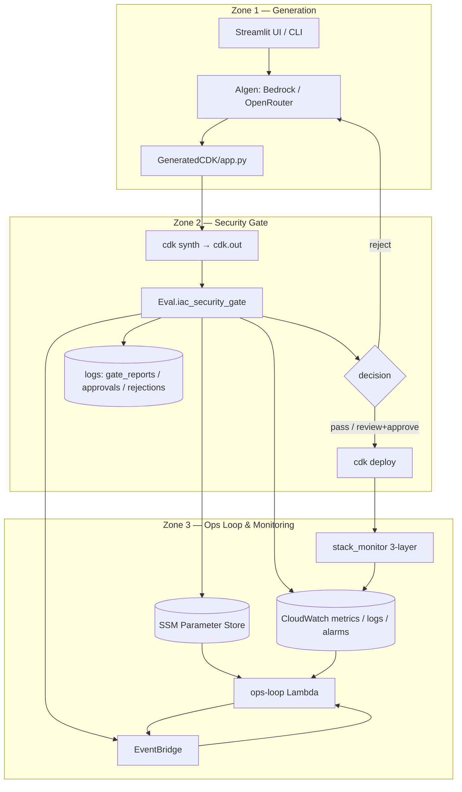
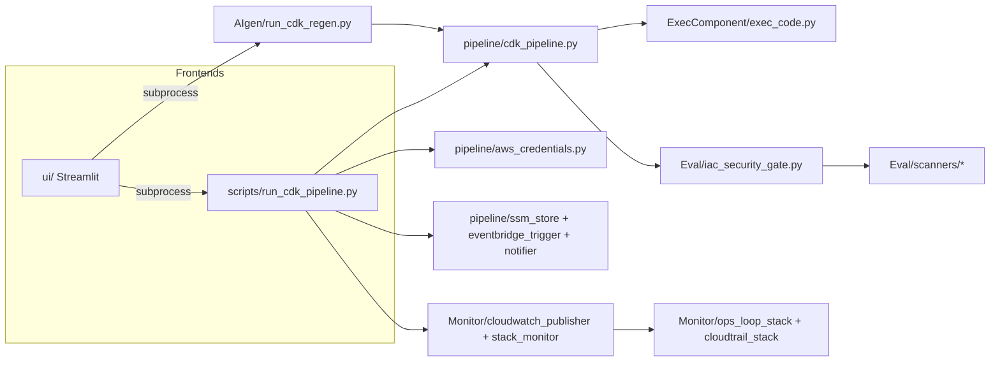
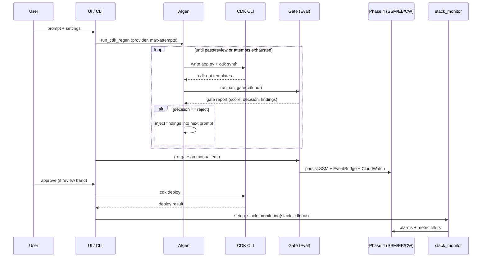
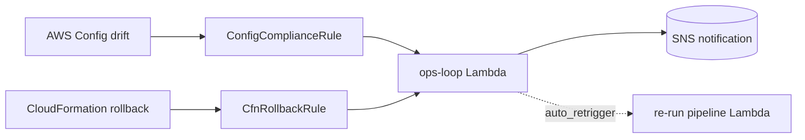

# SysSecOps Hybrid IaC Pipeline with an Integrated Risk-Scoring Security Gate

### A Thesis Project Report

---

## Abstract

Infrastructure-as-Code (IaC) has made cloud provisioning programmable and repeatable, but it
has also shifted a large class of security misconfigurations *left* into the source code that
defines an environment. This project designs and implements a **hybrid SysSecOps pipeline**
that places a **multi-scanner, risk-scored security gate between `cdk synth` and `cdk deploy`**,
so that no AWS CloudFormation change is applied until it has been statically analysed, costed,
checked against live account compliance, and assigned a quantitative risk score. The pipeline
combines (a) LLM-based generation of AWS CDK code, (b) a feedback loop that injects gate
findings back into the generation prompt for automated remediation, (c) an auditable
approval/rejection workflow, and (d) a Phase 4 *operational loop* that publishes real-time
observability (CloudWatch metrics, SSM state, EventBridge events) and attaches a three-layer
security-monitoring mesh to every deployed stack. The system is exposed both as a command-line
pipeline and as a Streamlit operator console. This report documents the motivation,
architecture, methodology, component-level design, the risk-scoring model (both the proposed
multi-factor formulation and the implemented additive formulation), the security posture, and
an evaluation against the design objectives, followed by limitations and future work.

---

## Table of Contents

1. [Introduction](#1-introduction)
2. [Background and Related Work](#2-background-and-related-work)
3. [System Architecture](#3-system-architecture)
4. [Methodology](#4-methodology)
5. [Component Design](#5-component-design)
6. [Risk-Scoring Engine](#6-risk-scoring-engine)
7. [Implementation by Phase](#7-implementation-by-phase)
8. [Phase 4 — Operational Loop and Monitoring](#8-phase-4--operational-loop-and-monitoring)
9. [Security Considerations](#9-security-considerations)
10. [Results and Evaluation](#10-results-and-evaluation)
11. [Limitations](#11-limitations)
12. [Future Work](#12-future-work)
13. [Conclusion](#13-conclusion)
14. [Appendices](#14-appendices)

---

## 1. Introduction

### 1.1 Motivation

Modern cloud deployments are defined in code. A single CDK or Terraform change can open a
security group to the public internet, disable encryption on a database, or grant a wildcard
IAM permission. Traditional security review happens *after* provisioning, when the misconfigured
resource is already live and exploitable. The DevSecOps principle of *shifting security left*
argues that these defects should be caught at the earliest possible point — ideally before the
infrastructure is ever created.

A second pressure is the rise of **AI-assisted code generation**. Large language models can
produce IaC quickly, but they do not guarantee secure or cost-bounded output. A generation
workflow without an automated gate simply produces insecure infrastructure faster.

### 1.2 Problem Statement

> *How can an automated pipeline generate cloud infrastructure code, quantitatively assess its
> security and cost risk before deployment, block or remediate unsafe changes, and continue to
> monitor the deployed environment — with full auditability and graceful degradation when
> individual tools are unavailable?*

### 1.3 Objectives

| # | Objective |
|---|---|
| O1 | Generate synthesizable AWS CDK (Python) code from a natural-language prompt. |
| O2 | Evaluate the *synthesized CloudFormation* (not just source) with multiple independent scanners. |
| O3 | Aggregate findings into a single, explainable **risk score** and a `pass`/`review`/`reject` decision. |
| O4 | Enforce that `cdk deploy` runs only when the gate decision (or a manual approval) allows it. |
| O5 | Close the loop: feed gate findings back into generation to automatically remediate. |
| O6 | Persist an immutable audit trail of approvals and rejections with the approver's AWS identity. |
| O7 | Provide real-time observability and post-deploy security monitoring (Phase 4 ops loop). |
| O8 | Degrade gracefully — a missing scanner or absent credentials must never crash the pipeline. |
| O9 | Expose the workflow through both a CLI and an operator GUI. |

### 1.4 Contributions

- A **gate-between-synth-and-deploy** architecture that analyses the real CloudFormation
  artifact rather than the higher-level CDK source.
- A **cross-source deduplication** mechanism that prevents score inflation when several
  scanners report the same underlying issue.
- A **generate → synth → gate → regenerate** feedback loop driven by structured findings.
- A **Phase 4 operational loop** integrating SSM, EventBridge, SNS, CloudWatch, Application
  Insights, CloudTrail, and VPC flow logs into an event-driven remediation and monitoring mesh.
- A reusable, **graceful-degradation contract** applied uniformly across every external tool
  and AWS API call.

### 1.5 Scope

The implementation targets the **AWS CDK (Python)** deployment path of the broader SysSecOps
model. The conceptual model also includes an Ansible/private-node path (Zone 3 hybrid
infrastructure); this report focuses on the implemented CDK-first subset. The Streamlit UI,
CLI, gate, regen loop, and Phase 4 ops loop are fully implemented.

---

## 2. Background and Related Work

### 2.1 DevSecOps and Shift-Left Security

DevSecOps integrates security controls directly into the CI/CD pipeline rather than treating
security as a separate, post-hoc gate. *Shift-left* extends this by moving controls as early as
possible. For IaC, the earliest meaningful checkpoint is the **synthesized template**: the
point at which abstract constructs become concrete CloudFormation resources but before any API
call provisions them.

### 2.2 IaC Security Scanning

Several mature tools analyse IaC artifacts:

- **Checkov** — policy-as-code scanner with 200+ built-in AWS checks (encryption, IAM, logging,
  networking).
- **cfn-lint** — CloudFormation linter detecting malformed templates and best-practice
  violations.
- **Infracost** — cost estimation from IaC, enabling *cost as a risk dimension*.
- **AWS Config** — live account-level compliance state, complementing static analysis with
  runtime context.

Each tool individually produces severity-tagged findings. The novelty here is **aggregating**
them into a single scored decision with deduplication, and combining static findings with
**cost** and **live compliance** signals.

### 2.3 The SysSecOps Model

The project derives from the SysSecOps hybrid model
([`SysSecOps-hybrid-with-RiskScringEngine-integrated-to-IaCSecurityGate.md`](SysSecOps-hybrid-with-RiskScringEngine-integrated-to-IaCSecurityGate.md)),
which organises the system into three zones:

| Zone | Name | Responsibility | Implemented here |
|---|---|---|---|
| **Zone 1** | AI + IaC Local Dev | Generate IaC, local validate (`cdk synth`/`diff`) | `AIgen/`, `GeneratedCDK/` |
| **Zone 2** | IaC Security Gate | Scan → score → gate → deploy | `Eval/`, `pipeline/`, `scripts/` |
| **Zone 3** | Hybrid Infra & Ops Monitoring | SSM, EventBridge, CloudWatch, drift feedback | `Monitor/`, `pipeline/` (Phase 4) |

The risk-scoring engine sits at the boundary of Zone 1 and Zone 2: it consumes scanner output
and emits the pass/review/reject decision that governs whether code proceeds to deployment or
returns to Zone 1 for regeneration.

---

## 3. System Architecture

### 3.1 High-Level View



### 3.2 Module Map



### 3.3 End-to-End Sequence



### 3.4 Key Architectural Decisions

| Decision | Rationale |
|---|---|
| Gate the **synthesized template**, not CDK source | The template is the ground truth of what will be provisioned; CDK source can hide the final shape. |
| **Subprocess isolation** of generation/deploy from the UI | Keeps long-running, credential-bearing operations out of the Streamlit process; credentials passed via env, never argv. |
| **Graceful degradation everywhere** | A missing scanner or absent AWS credentials yields a status flag, not a crash — the gate still produces a decision. |
| **Append-only audit** in `logs/` | Every approval/rejection is a discrete JSON record with the approver's STS ARN, supporting non-repudiation. |
| **Phase 4 toggled by env vars** | `SSM_ENABLED`, `EVENTBRIDGE_ENABLED`, `SNS_TOPIC_ARN` let the same code run in local-only or fully cloud-integrated modes. |

---

## 4. Methodology

### 4.1 The Generate → Synth → Gate → Remediate Loop

The core engineering method is a closed feedback loop implemented in
[`AIgen/run_cdk_regen.py`](AIgen/run_cdk_regen.py):

1. **Generate** — the selected provider (Bedrock or OpenRouter) produces a single-stack CDK app
   under a system prompt that enforces least-privilege IAM, default encryption, no public
   SSH/RDP, `RemovalPolicy.RETAIN` for stateful resources, and non-interactive defaults.
2. **Synth** — stale templates are cleared, then `cdk synth` runs. On failure, the cleaned
   synth error (jsii/node noise stripped) plus the failing code are injected into the next
   prompt.
3. **Gate** — [`Eval/iac_security_gate.py`](Eval/iac_security_gate.py) scores the templates.
4. **Decide** — `pass`/`review` exits the loop successfully; `reject` injects the findings into
   the next prompt and retries up to `--max-attempts`.

This makes the security gate not merely a blocker but an **active teacher** of the generator.

### 4.2 Gate Placement

The gate is invoked from [`pipeline/cdk_pipeline.py`](pipeline/cdk_pipeline.py) strictly between
`cdk synth` and `cdk deploy`. `can_deploy()` is the single chokepoint: `pass` deploys
automatically, `review` deploys only with explicit manual approval, `reject` is blocked.

### 4.3 Graceful Degradation Contract

Every external tool adapter and AWS call returns a **status** rather than raising. Statuses
include `ok`, `skipped`, `not_installed`, `no_credentials`, `not_configured`, `not_supported`,
and `error`. The gate records these in `scanner_status` and proceeds with whatever signal is
available. This guarantees a decision is always produced, which is essential for an automated
pipeline.

### 4.4 Credential Handling Method

[`pipeline/aws_credentials.py`](pipeline/aws_credentials.py) centralises credential resolution
in a single chain: cache → environment → named profile → SSO token export → boto3 default.
Credentials are propagated to subprocesses as **environment variables only**, never as
command-line arguments (which would leak into process listings and logs).

### 4.5 Auditability Method

Approvals and rejections are written as discrete JSON records that embed the approver's identity
resolved from `aws sts get-caller-identity` (ARN + account). This supports after-the-fact
review and non-repudiation.

---

## 5. Component Design

Each top-level module has its own README with per-file detail. This section summarises their
roles and contracts; see the linked module READMEs for signatures and field-level schemas.

### 5.1 `AIgen/` — Generation (Zone 1)

| File | Role |
|---|---|
| `bedrock_codegen.py` | AWS Bedrock backend (Qwen 3 Coder 30B) |
| `openrouter_codegen.py` | OpenRouter HTTP backend (drop-in alternative) |
| `run_cdk_regen.py` | The generate→synth→gate→regenerate loop |

Both backends share an identical contract: plain-Python output prefixed with an
`# INSTRUCTIONS … # END INSTRUCTIONS` block, saved alongside a `.instructions.txt` file. See
[`AIgen/README.md`](AIgen/README.md).

### 5.2 `Eval/` — Security Gate (Zone 2)

The gate ([`Eval/iac_security_gate.py`](Eval/iac_security_gate.py)) orchestrates four pluggable
scanner adapters in `Eval/scanners/` plus an internal heuristic analyser, deduplicates findings,
scores them, and persists a report. See [`Eval/README.md`](Eval/README.md).

| Adapter | Signal | Degradation |
|---|---|---|
| `checkov_adapter.py` | Policy-as-code findings | `not_installed` / `error` / `skipped` |
| `cfn_lint_adapter.py` | Template correctness | `not_installed` / `error` / `skipped` |
| `infracost_adapter.py` | Monthly cost (USD) | `not_supported` / `not_installed` |
| `aws_config_adapter.py` | Live compliance violations | `no_credentials` / `not_configured` |

### 5.3 `pipeline/` — Orchestration & Governance

Wraps the CDK lifecycle, the deploy decision (`can_deploy`), audit records, and the Phase 4
publishers (`ssm_store`, `eventbridge_trigger`, `notifier`) plus the ops-loop Lambda
(`lambda_handler`). See [`pipeline/README.md`](pipeline/README.md).

### 5.4 `ExecComponent/` — Execution Backbone

[`ExecComponent/exec_code.py`](ExecComponent/exec_code.py) runs all CDK CLI commands and
captures merged, line-buffered stdout/stderr, returning `{return_code, output}`. The return
code is the signal that drives gate and deploy decisions. See
[`ExecComponent/README.md`](ExecComponent/README.md).

### 5.5 `Monitor/` — Phase 4 Observability

Two CDK stacks (ops-loop + CloudTrail) and two runtime helpers (`cloudwatch_publisher`,
`stack_monitor`) implement real-time gate metrics and three-layer post-deploy security
monitoring. See [`Monitor/README.md`](Monitor/README.md).

### 5.6 `scripts/` — CLI Entry Point

[`scripts/run_cdk_pipeline.py`](scripts/run_cdk_pipeline.py) is the orchestrator that wires all
modules together, with 18 CLI flags and a well-defined return-code contract consumed by the UI.
See [`scripts/README.md`](scripts/README.md).

### 5.7 `ui/` — Operator Console

A modular Streamlit app with six tabs that drives the full pipeline via subprocesses, with
credential injection, live log streaming, gate-report rendering, and AWS-backed monitoring. See
[`ui/README.md`](ui/README.md).

### 5.8 `GeneratedCDK/` — Deployment Target

The working CDK project whose `app.py` is rewritten by the generator each run. See
[`GeneratedCDK/README.md`](GeneratedCDK/README.md).

---

## 6. Risk-Scoring Engine

The risk-scoring engine is the analytical heart of Zone 2. This project distinguishes between
the **proposed** multi-factor model (a research formulation) and the **implemented** additive
model (what the code computes today).

### 6.1 Proposed Multi-Factor Model

The thesis formulation ([`riskScoring.md`](riskScoring.md)) defines a context-aware score as a
weighted aggregation of four normalised factors:

$$\text{Risk Score} = W_s\,S + W_e\,E + W_x\,X + W_c\,C, \qquad W_s + W_e + W_x + W_c = 1$$

where $S$ is severity, $E$ exploitability, $X$ exposure (deployment context — public, internal,
on-prem, sandbox), and $C$ confidence, each normalised to $[0,1]$ and the result scaled to
$[0,100]$. This model captures that the *same* finding carries different risk depending on
whether the resource is internet-facing or sandboxed.

### 6.2 Implemented Additive Model

The deployed gate uses a transparent, auditable additive score that combines static severity
with two operational dimensions — **cost** and **live compliance**:

$$\text{score} = \sum_{f \in \text{deduped findings}} w(\text{sev}_f) \;+\; c(\Delta\$) \;+\; 5 \cdot v_\text{config}$$

**Severity weights $w$:**

| Severity | Points |
|---|---|
| Critical | 20 |
| High | 10 |
| Medium | 5 |
| Low | 1 |

**Cost term $c(\Delta\$)$** (from Infracost):

| Monthly delta | Points |
|---|---|
| $> \$50$ | 10 |
| $> \$10$ | 5 |
| otherwise | 0 |

**Compliance term:** `5 × aws_config_violations`.

### 6.3 Decision Thresholds

| Score | Decision | Effect |
|---|---|---|
| $0\text{–}20$ | `pass` | Auto-deploy allowed |
| $21\text{–}80$ | `review` | Manual approval required |
| $> 80$ | `reject` | Blocked → regenerate / remediate |

These are defined in `THRESHOLDS = {"pass_max": 20, "review_max": 80}`.

### 6.4 Heuristic Checks

In addition to external scanners, the gate's own analyser inspects each CloudFormation resource:

| Resource | Check | Severity |
|---|---|---|
| `EC2::SecurityGroup` | SSH (22) from `0.0.0.0/0` | critical |
| `EC2::SecurityGroup` | any public ingress | high |
| `S3::Bucket` | missing/!all-true public access block | high |
| `S3::Bucket` | public-read/-write ACL | critical |
| `IAM::Policy` | `Action:*` AND `Resource:*` | critical |
| `RDS::DBInstance` | `StorageEncrypted != true` | high |
| `EC2::Volume` | `Encrypted != true` | medium |

### 6.5 Cross-Source Deduplication

Findings from heuristics, Checkov, and cfn-lint are merged by the key
`(resource_id, template, category)`. When several scanners report the same issue, the highest
severity is kept and source labels are merged (e.g. `iac_security_gate+checkov`). This prevents
a single misconfiguration from being scored three times — a critical correctness property for an
additive model. Resource IDs are normalised (e.g. `AWS::S3::Bucket.MyBucket` → `MyBucket`) so
cross-tool matching works.

### 6.6 Override and Provenance

Cost and compliance inputs follow a strict priority: explicit caller value → auto-detected
(Infracost/boto3) → graceful zero. The report records whether each value was overridden
(`cost_delta_override`, `aws_config_override`) for provenance.

### 6.7 Gate Report Schema (excerpt)

```json
{
  "run_id": "cdk_20260614T120000Z",
  "score": 35,
  "decision": "review",
  "thresholds": { "pass_max": 20, "review_max": 80 },
  "components": { "severity": 25, "cost": 5, "aws_config": 5 },
  "inputs": { "cost_delta_usd": 15.5, "aws_config_violations": 1, "templates": ["Stack.json"] },
  "scanner_status": { "checkov": "ok", "cfn_lint": "ok", "infracost": "ok", "aws_config": "ok" },
  "findings": [
    { "severity": "critical", "source": "iac_security_gate", "category": "sg_ssh_open",
      "resource_id": "MySG", "template": "Stack.json",
      "message": "Security group allows SSH from anywhere (0.0.0.0/0)." }
  ],
  "report_path": "logs/gate_reports/gate_cdk_20260614T120000Z.json"
}
```

The full field reference is in [`Eval/README.md`](Eval/README.md).

---

## 7. Implementation by Phase

| Phase | Theme | Key deliverables |
|---|---|---|
| **Phase 1** | Core gate | Heuristics + Checkov + cfn-lint adapters; additive scoring; pass/review/reject |
| **Phase 2** | Risk dimensions | Infracost cost analysis; AWS Config live compliance; override logic |
| **Phase 3** | Governance | Approval/rejection audit records with STS identity; SNS notifications; CDK regen loop |
| **Phase 4** | Ops loop | SSM state, EventBridge events, CloudWatch metrics/logs, 3-layer monitoring, drift/rollback Lambda |

Phase 4 is documented in depth in [`PHASE4_REPORT.md`](PHASE4_REPORT.md); the roadmap is in
[`CDK-ONLY-NEXT-STEPS.md`](CDK-ONLY-NEXT-STEPS.md).

---

## 8. Phase 4 — Operational Loop and Monitoring

### 8.1 Real-Time Gate Observability

After every gate evaluation the pipeline publishes:

- **SSM Parameter Store** — `/syssecops/gate/{stack}/latest_{score,decision,run_id,report_path}`.
- **EventBridge** — a `GateDecision` event (`source: syssecops.gate`).
- **CloudWatch** — metrics `GateScore`, `GateDecision`, `CriticalFindings`, `HighFindings` in
  namespace `SysSecOps/Gate`, plus the full report as a structured log event.

### 8.2 Event-Driven Remediation



The `syssecops-ops-loop` Lambda reacts to AWS Config compliance drift and CloudFormation
rollback/failure events, notifies via SNS, and — in `auto_retrigger` mode — re-invokes the
pipeline to remediate.

### 8.3 Three-Layer Post-Deploy Monitoring

[`Monitor/stack_monitor.py`](Monitor/stack_monitor.py) attaches monitoring to each deployed stack:

- **Layer 1 — Application Insights:** auto-discovery of EC2/Lambda/RDS/ECS.
- **Layer 2 — Per-resource alarms:** operational (CPU, errors, storage) *and* security
  (network packet spikes, Lambda timeout exhaustion, RDS connection floods, S3 4xx/5xx).
- **Layer 3a — CloudTrail CIS alarms:** seven alarms (unauthorized API calls, root usage, IAM /
  security-group / S3-policy / CloudTrail changes, console auth failures).
- **Layer 3b — VPC flow log alarms:** REJECT floods (port-scan indicator) and SSH/RDP from the
  internet.

### 8.4 Dashboard and Alarms

The `SysSecOpsOpsLoopStack` provisions the `SysSecOpsGate` CloudWatch dashboard (gate-score
trend, findings counts, alarm widgets) and two gate alarms (`syssecops-gate-reject` on
`GateDecision ≥ 2`, `syssecops-critical-findings` on `CriticalFindings ≥ 1`).

---

## 9. Security Considerations

The pipeline is itself a security-sensitive system; its design follows OWASP Top 10 and
least-privilege principles.

| Concern | Mitigation |
|---|---|
| **Credential leakage** | Credentials passed to subprocesses via env vars only, never argv; `~/.aws/credentials` written with `chmod 600`. |
| **Least privilege** | The ops-loop Lambda role scopes SSM/Logs to `/syssecops/*`; the generation prompt forbids wildcard IAM. |
| **Prompt injection** | Generated code is *gated*, not trusted: it is synthesized and statically analysed before any deploy; tool output is parsed structurally, not executed. |
| **Auditability / non-repudiation** | Approvals/rejections embed the STS caller ARN and account. |
| **Fail-safe defaults** | Unknown severities default to 1 point; missing scanners degrade to a recorded status; deploy is blocked unless explicitly allowed. |
| **Data at rest** | CloudTrail S3 bucket: SSE-S3, versioning, block-public-access, enforce-SSL, `RETAIN`. |
| **Encryption-by-default policy** | The generator is instructed to enable encryption on S3/RDS/EBS; the gate penalises violations. |

A note on safe use: the system is designed to **detect and prevent** insecure infrastructure,
not to produce it. The security alarms (Layer 3) are defensive monitoring constructs.

---

## 10. Results and Evaluation

### 10.1 Evaluation Method

The system was exercised through repeated generation–gate–deploy cycles. Artifacts persisted
under `logs/` provide a concrete record of behaviour:

| Artifact class | Path | Observed count |
|---|---|---|
| Gate reports | `logs/gate_reports/` | 12 |
| Approval records | `logs/approvals/` | 11 |
| Rejection records | `logs/rejections/` | 0 |
| Regen-loop runs | `logs/cdk_regen/` | 3 |

> Counts reflect the current working tree at the time of writing and illustrate the audit trail
> the system produces; they are not a controlled benchmark.

### 10.2 Objective Coverage

| Objective | Status | Evidence |
|---|---|---|
| O1 Generate CDK | ✅ | `AIgen/` Bedrock + OpenRouter backends |
| O2 Multi-scanner eval | ✅ | 4 adapters + heuristics in `Eval/` |
| O3 Risk score + decision | ✅ | Additive model, `pass`/`review`/`reject` |
| O4 Deploy gating | ✅ | `can_deploy()` chokepoint |
| O5 Feedback loop | ✅ | `run_cdk_regen.py` injects findings |
| O6 Audit trail | ✅ | `logs/approvals` + `logs/rejections` with ARN |
| O7 Ops loop / monitoring | ✅ | Phase 4 (`Monitor/`, `pipeline/`) |
| O8 Graceful degradation | ✅ | Status flags across all adapters |
| O9 CLI + GUI | ✅ | `scripts/` + `ui/` |

### 10.3 Qualitative Findings

- **Deduplication materially affects the score.** Without it, an SSH-open security group flagged
  by both the heuristic analyser and Checkov would contribute 40 points instead of 20, pushing a
  borderline change from `review` into `reject`.
- **Cost as a risk dimension** surfaces expensive-but-syntactically-valid templates that
  pure security scanners would pass.
- **The feedback loop converges** on common misconfigurations (public access blocks, encryption)
  because the findings are specific and machine-actionable.
- **Graceful degradation is essential in practice** — runs frequently execute with one or more
  scanners absent (e.g. AWS Config `no_credentials`), and the pipeline still yields a decision.

---

## 11. Limitations

- **Single-stack assumption.** The generation prompt enforces exactly one `Stack`; multi-stack
  applications are out of scope and would complicate template-count-based reasoning.
- **Additive vs. multi-factor scoring.** The implemented score does not yet incorporate the
  proposed exploitability/exposure/confidence factors; exposure (deployment context) in
  particular is modelled conceptually but not yet wired into the gate weights.
- **Heuristic coverage.** The internal analyser covers common high-impact checks but defers
  breadth to Checkov; novel resource types rely entirely on external tools.
- **Cost estimation fidelity.** Infracost returns `$0`/`not_supported` for purely usage-based
  resources, so the cost dimension is conservative.
- **Ansible / private-node path (Zone 3 hybrid).** Implemented for the CDK/AWS path only.
- **No formal benchmark.** Evaluation is demonstrative (artifact-based), not a controlled study
  against a labelled misconfiguration corpus.

---

## 12. Future Work

1. **Implement the full multi-factor risk model** ($W_sS + W_eE + W_xX + W_cC$), wiring
   deployment-context exposure into the gate so the same finding scores differently by
   environment.
2. **Confidence weighting** to down-weight low-confidence scanner findings.
3. **Multi-stack and Terraform support** to generalise beyond single CDK stacks.
4. **Policy-as-data thresholds** — externalise `THRESHOLDS` and severity weights to a policy file
   for per-organisation tuning.
5. **Controlled evaluation** against a labelled corpus (e.g. seeded misconfigurations) to report
   precision/recall of the gate.
6. **Closed-loop auto-remediation in production** — extend `auto_retrigger` beyond notification to
   verified self-healing with guardrails.
7. **Ansible/private-node integration** to complete Zone 3 of the SysSecOps model.

---

## 13. Conclusion

This project demonstrates that an automated IaC pipeline can be made *security-first* by
inserting a quantitative, multi-scanner risk gate at the precise moment between synthesis and
deployment. By analysing the synthesized CloudFormation, deduplicating findings across tools,
folding in cost and live-compliance signals, and exposing a single explainable decision, the
gate turns a heterogeneous set of scanners into a coherent governance control. The
generate→synth→gate→regenerate loop further closes the gap between AI code generation and secure
output, using the gate's own findings to drive remediation. Finally, the Phase 4 operational
loop extends the guarantee from *deploy-time* to *run-time*, attaching real-time observability
and a defensive monitoring mesh to every deployed stack. The result is a coherent, auditable,
and gracefully degrading realisation of the SysSecOps model's Zone 1–Zone 3 vision for the AWS
CDK path.

---

## 14. Appendices

### Appendix A — Documentation Index

| Document | Scope |
|---|---|
| [`README.md`](README.md) | Repository overview & quick start |
| [`AIgen/README.md`](AIgen/README.md) | Generation backends + regen loop |
| [`Eval/README.md`](Eval/README.md) | Gate scoring, scanners, report schema |
| [`pipeline/README.md`](pipeline/README.md) | Orchestration + Phase 4 governance |
| [`Monitor/README.md`](Monitor/README.md) | Ops loop, alarms, 3-layer monitoring |
| [`ExecComponent/README.md`](ExecComponent/README.md) | Subprocess execution helpers |
| [`scripts/README.md`](scripts/README.md) | CLI flags + return codes |
| [`ui/README.md`](ui/README.md) | Streamlit operator console |
| [`GeneratedCDK/README.md`](GeneratedCDK/README.md) | CDK deployment target |
| [`PHASE4_REPORT.md`](PHASE4_REPORT.md) | Phase 4 deep dive |
| [`riskScoring.md`](riskScoring.md) | Proposed multi-factor risk model |

### Appendix B — Pipeline Return Codes

| Code | Meaning |
|---|---|
| 0 | Success |
| 2 | Project directory not found |
| 3 | Gate report not found (`--approve-run-id`) |
| 9 | Bootstrap failed |
| 10 | Synth failed |
| 11 | Diff failed |
| 12 | Deploy failed |
| 21 | Review required (not approved) |
| 22 | Rejected (regen attempted or no prompt) |

### Appendix C — Key Environment Variables

| Variable | Default | Purpose |
|---|---|---|
| `AWS_DEFAULT_REGION` / `AWS_REGION` / `CDK_DEFAULT_REGION` | `us-east-1` | Region resolution |
| `BEDROCK_MODEL_ID` | `qwen.qwen3-coder-30b-a3b-v1:0` | Bedrock model |
| `OPENROUTER_API_KEY` | — | OpenRouter auth |
| `OPENROUTER_MODEL_ID` | `qwen/qwen3-coder-30b-a3b-instruct` | OpenRouter model |
| `SNS_TOPIC_ARN` | unset (disabled) | Notifications + alarm actions |
| `SSM_ENABLED` | `true` | Phase 4 SSM persistence |
| `EVENTBRIDGE_ENABLED` | `true` | Phase 4 event publishing |
| `RETRIGGER_MODE` | `notify_only` | Ops-loop Lambda mode |
| `PIPELINE_LAMBDA_ARN` | unset | Target for `auto_retrigger` |

### Appendix D — Scanner Status Vocabulary

`ok` · `skipped` · `not_installed` · `no_credentials` · `not_configured` · `not_supported` ·
`error` — recorded per scanner in `scanner_status` so the decision is always explainable.

### Appendix E — Repository File Index

See each module's README for a per-file breakdown:
`AIgen/` (3 files), `Eval/` + `Eval/scanners/` (5 files), `pipeline/` (7 files),
`Monitor/` (7 files), `ExecComponent/` (1 file), `scripts/` (1 file), `ui/` (10 files),
`GeneratedCDK/` (deployment target).
