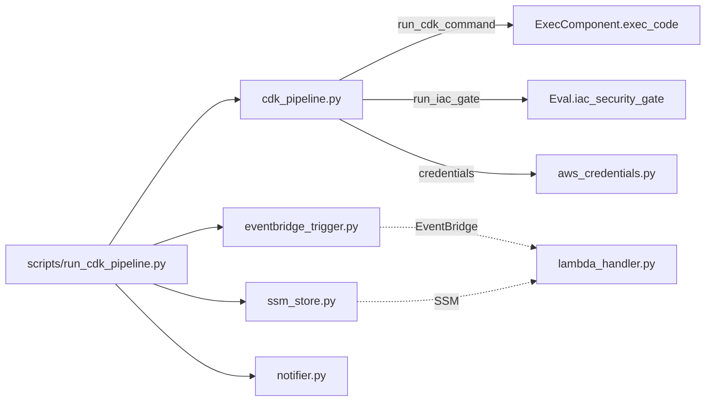

# pipeline — CDK Orchestration & Phase 4 Governance

## Purpose

`pipeline/` is the orchestration core of the SysSecOps hybrid pipeline. It wraps the
`cdk synth → gate → diff → deploy` lifecycle, enforces deploy gating based on the
IaC security gate decision, persists approval/rejection audit records, and drives the
Phase 4 ops-loop (SSM persistence, EventBridge events, SNS notifications, drift/rollback
automation).

It sits between **Zone 1** (generation, `AIgen/`) and **Zone 2** (risk evaluation, `Eval/`),
and is the module that actually executes AWS CDK commands and AWS API calls.



## Files

| File | Role |
|---|---|
| `__init__.py` | Package marker (no public API) |
| `aws_credentials.py` | Central AWS credential resolver (boto3 chain + SSO auto-export) |
| `cdk_pipeline.py` | Core orchestration: synth/bootstrap/diff/deploy, gate, deploy decision, audit records |
| `ansible_pipeline.py` | On-prem orchestration: ansible-playbook syntax-check / `--check` / deploy + Ansible gate runner |
| `git_changes.py` | Git changed-file discovery to scope the gate to modified files (`--base-ref`) |
| `hybrid_status.py` | Read-only hybrid visibility: SSM managed nodes, SSM compliance, Tailscale devices |
| `eventbridge_trigger.py` | Publishes `GateDecision` events to the EventBridge default bus |
| `lambda_handler.py` | Ops-loop Lambda handler: reacts to AWS Config drift and CloudFormation rollback |
| `notifier.py` | SNS notifier for pipeline lifecycle events |
| `ssm_store.py` | SSM Parameter Store persistence/retrieval of latest gate result per target |

> **Hybrid note:** the on-prem path reuses `can_deploy`, `write_approval`, and
> `write_rejection_record` from `cdk_pipeline.py` unchanged; the `ansible_` run-id
> prefix makes the persisted records (`approval_ansible_*.json`) self-describing.
> The hybrid entrypoint is `scripts/run_hybrid_pipeline.py`.

---

## `aws_credentials.py` — Credential Resolver

Single source of truth for AWS credentials. Resolution order: module cache → environment
variables → named AWS profile → SSO token export (`aws configure export-credentials`) →
default boto3 chain.

| Function | Signature | Returns |
|---|---|---|
| `get_session` | `(profile_name=None, force_refresh=False)` | cached/fresh `boto3.Session` or `None` |
| `get_identity` | `(session=None)` | `{UserId, Account, Arn}` from STS, or `None` |
| `list_sso_profiles` | `()` | profile names in `~/.aws/config` with SSO keys |
| `login_sso` | `(profile_name)` | runs `aws sso login`, exports creds; returns `bool` |
| `export_sso_credentials` | `(profile_name)` | exports SSO tokens into `os.environ`; returns `bool` |
| `invalidate_cache` | `()` | clears the cached session |

- **Reads:** `~/.aws/config`, `~/.aws/credentials`, STS API.
- **Writes:** `os.environ` (`AWS_ACCESS_KEY_ID`, `AWS_SECRET_ACCESS_KEY`, `AWS_SESSION_TOKEN`).
- **Region fallback:** `AWS_DEFAULT_REGION` → `AWS_REGION` → `CDK_DEFAULT_REGION` → `us-east-1`.
- Consumed by every AWS-touching module (`ssm_store`, `eventbridge_trigger`,
  `Monitor/cloudwatch_publisher`, `Monitor/stack_monitor`).

---

## `cdk_pipeline.py` — Orchestration Core

| Function | Purpose |
|---|---|
| `resolve_cdk_env()` | Builds env with `CDK_DEFAULT_REGION` / `CDK_DEFAULT_ACCOUNT` via STS |
| `build_cdk_command(name)` | Constructs the CDK CLI argv (`deploy` adds `--all --require-approval never`) |
| `run_bootstrap(project_dir, env=None)` | Runs `cdk bootstrap` → `{command, command_name, return_code, output}` |
| `run_cdk_command(project_dir, name, env=None)` | Runs `synth`/`diff`/`deploy` and returns the same result dict |
| `clear_cdk_out(project_dir)` | Removes stale `*.template.json`, `manifest.json`, `tree.json` before synth |
| `run_iac_gate(project_dir, ...)` | Calls `Eval.iac_security_gate.evaluate()`; returns full gate report |
| `can_deploy(gate_report, *, manual_review_approved)` | Deploy decision → `(bool, reason)` |
| `extract_stack_name(gate_report)` | Derives stack name from template filenames (fallback: run_id) |
| `load_gate_report(run_id, log_dir=None)` | Loads `logs/gate_reports/gate_<run_id>.json` |
| `write_approval(run_id, gate_report, approver="cli")` | Writes `logs/approvals/approval_<run_id>.json` |
| `write_rejection_record(run_id, gate_report)` | Writes `logs/rejections/rejection_<run_id>.json` |

**Deploy decision logic (`can_deploy`):**

- `decision == "pass"` → deploy allowed.
- `decision == "review"` and `manual_review_approved` → deploy allowed.
- otherwise → blocked.

**Dependencies:** `ExecComponent.exec_code` (CDK CLI execution),
`Eval.iac_security_gate` (risk evaluation).

---

## `ssm_store.py` — Gate State Persistence (Phase 4)

Persists the latest gate result per stack under the SSM prefix `/syssecops/gate`.

| Function | Purpose |
|---|---|
| `write_gate_result(stack_name, run_id, score, decision, report_path)` | Writes 4 SSM params; never raises |
| `read_gate_result(stack_name)` | Returns `{latest_score, latest_decision, latest_run_id, latest_report_path}` or `None` |
| `list_monitored_stacks()` | All stack names tracked under `/syssecops/gate/` |

SSM parameter layout:

```
/syssecops/gate/{stack_name}/latest_score
/syssecops/gate/{stack_name}/latest_decision
/syssecops/gate/{stack_name}/latest_run_id
/syssecops/gate/{stack_name}/latest_report_path
```

Disable with `SSM_ENABLED=false`.

---

## `eventbridge_trigger.py` — Event Publisher (Phase 4)

| Function | Purpose |
|---|---|
| `publish_gate_event(run_id, stack_name, decision, score)` | Publishes a `GateDecision` event; non-blocking |

- **Event source:** `syssecops.gate`  · **Detail type:** `GateDecision`.
- **Detail payload:** `{run_id, stack_name, decision, score, timestamp}`.
- Disable with `EVENTBRIDGE_ENABLED=false`.

---

## `notifier.py` — SNS Notifications (Phase 3)

| Symbol | Purpose |
|---|---|
| `SNSNotifier(topic_arn, region)` | `.send(event_type, gate_report=None, extra=None)` publishes JSON to SNS |
| `get_notifier()` | Factory: returns `SNSNotifier` if `SNS_TOPIC_ARN` is set, else `None` |

- Event types: `review_required`, `reject`, `deploy_success`, `deploy_failure`.
- Payload: `{event_type, timestamp, run_id, decision, score, top_findings[:5], ...extra}`.
- Never raises — notification failures never block the pipeline.

---

## `lambda_handler.py` — Ops-Loop Lambda (Phase 4)

Deployed by `Monitor/ops_loop_stack.py` as the `syssecops-ops-loop` function. Routes two
EventBridge patterns and reacts.

| Function | Purpose |
|---|---|
| `handler(event, context)` | Routes by `event.source` / `detail-type`; returns a result dict |

- **Triggers:** AWS Config `Config Rules Compliance Change` (drift) and
  CloudFormation `Stack Status Change` (rollback/failure states).
- **Reads:** SSM `/syssecops/gate/...` for last decision/run_id.
- **Actions:** publishes SNS notification (`drift_detected`, `stack_rollback`); in
  `RETRIGGER_MODE=auto_retrigger` it invokes `PIPELINE_LAMBDA_ARN` to re-run the pipeline.

---

## Environment Variables

| Variable | Default | Used by |
|---|---|---|
| `AWS_DEFAULT_REGION` / `AWS_REGION` / `CDK_DEFAULT_REGION` | `us-east-1` | all modules |
| `SNS_TOPIC_ARN` | unset (disabled) | `notifier`, `lambda_handler` |
| `SSM_ENABLED` | `true` | `ssm_store` |
| `EVENTBRIDGE_ENABLED` | `true` | `eventbridge_trigger` |
| `RETRIGGER_MODE` | `notify_only` | `lambda_handler`, `ops_loop_stack` |
| `PIPELINE_LAMBDA_ARN` | unset | `lambda_handler` (auto_retrigger) |

## Artifacts Written

| Path | Writer |
|---|---|
| `logs/gate_reports/gate_<run_id>.json` | `run_iac_gate` (via gate) |
| `logs/approvals/approval_<run_id>.json` | `write_approval` |
| `logs/rejections/rejection_<run_id>.json` | `write_rejection_record` |

## SysSecOps Alignment

Implements **Zone 1 → Zone 2 handoff** and the **Phase 4 ops loop**: deploy gating,
auditable approvals/rejections, real-time gate observability, and event-driven
drift/rollback remediation. See [`../PHASE4_REPORT.md`](../PHASE4_REPORT.md) and
[`../THESIS_REPORT.md`](../THESIS_REPORT.md).
