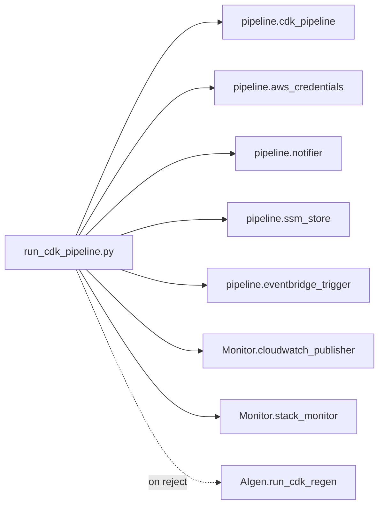

# scripts — Pipeline CLI Entry Point

## Purpose

`scripts/` holds the command-line entry point that orchestrates the full CDK pipeline:
`bootstrap → synth → gate → diff → deploy`, with approval workflows, rejection records, an
optional auto-regen loop, and Phase 4 observability (SSM, EventBridge, SNS, CloudWatch).

## Files

| File | Role |
|---|---|
| `run_cdk_pipeline.py` | CLI orchestrator that wires together `pipeline/`, `Eval/`, `Monitor/`, and `AIgen/` |



## Usage

```bash
# Full run — all scanners auto-enabled
python scripts/run_cdk_pipeline.py --project-dir GeneratedCDK

# Fast run — skip external scanners
python scripts/run_cdk_pipeline.py --project-dir GeneratedCDK --no-checkov --no-cfn-lint

# Manual-approve a review-band score and deploy
python scripts/run_cdk_pipeline.py --project-dir GeneratedCDK --manual-approve --deploy

# Approve an existing review-band gate report by run ID, then deploy
python scripts/run_cdk_pipeline.py --approve-run-id cdk_20260617T122700Z --deploy

# Auto-regenerate on reject
python scripts/run_cdk_pipeline.py --project-dir GeneratedCDK \
  --regen-on-reject --max-regen-attempts 3 \
  --prompt "Create an S3 bucket with versioning and encryption"

# Print last gate result per stack from SSM and exit
python scripts/run_cdk_pipeline.py --query-status
```

## Public Functions

| Function | Purpose |
|---|---|
| `parse_args()` | Parses all CLI flags |
| `main()` | Main pipeline orchestrator |
| `query_status_main()` | Read-only: print last gate result per stack from SSM |
| `approve_and_deploy_main(args, project_dir, env)` | Approve existing review-band report + optional deploy |

## CLI Flags

| Flag | Default | Description |
|---|---|---|
| `--project-dir` | `GeneratedCDK` | CDK project directory |
| `--run-id` | auto | Override gate-report filename |
| `--approve-run-id RUN_ID` | — | Skip synth+gate; approve an existing review-band report |
| `--cost-delta-usd` | auto (Infracost) | Override monthly cost delta (USD) |
| `--aws-config-violations` | auto (boto3) | Override AWS Config violation count |
| `--no-infracost` | off | Skip Infracost |
| `--no-aws-config` | off | Skip AWS Config fetch |
| `--no-checkov` | off | Skip Checkov |
| `--no-cfn-lint` | off | Skip cfn-lint |
| `--manual-approve` | off | Approve review band (21–80) for deploy |
| `--deploy` | off | Run `cdk deploy` if the gate allows |
| `--bootstrap` | off | Run `cdk bootstrap` first |
| `--prompt` | — | Original request (used with `--regen-on-reject`) |
| `--regen-on-reject` | off | On reject, invoke the CDK regen loop |
| `--max-regen-attempts` | `2` | Max regen attempts |
| `--query-status` | off | Print last gate result per stack from SSM and exit |
| `--log-file` | auto | Override log file path |
| `--verbose` | off | Also print log output to stderr |

## Return Codes

| Code | Meaning |
|---|---|
| `0` | Success |
| `2` | Project directory not found |
| `3` | Gate report not found (`--approve-run-id`) |
| `9` | Bootstrap failed |
| `10` | Synth failed |
| `11` | Diff failed |
| `12` | Deploy failed |
| `21` | Review required (not approved) |
| `22` | Rejected (regen attempted or no prompt provided) |

These codes are surfaced verbatim by the Streamlit UI via `ui/config.py::RETURN_CODE_MEANING`.

## Side Effects

- **Writes:** `logs/cdk_pipeline_<run_id>.log`, gate reports, approval/rejection records.
- **Phase 4:** persists to SSM, publishes an EventBridge `GateDecision` event, emits
  CloudWatch metrics + structured logs, and (on successful deploy) attaches 3-layer stack
  monitoring. SNS notifications fire when `SNS_TOPIC_ARN` is set.

See [`../README.md`](../README.md) and [`../THESIS_REPORT.md`](../THESIS_REPORT.md).
