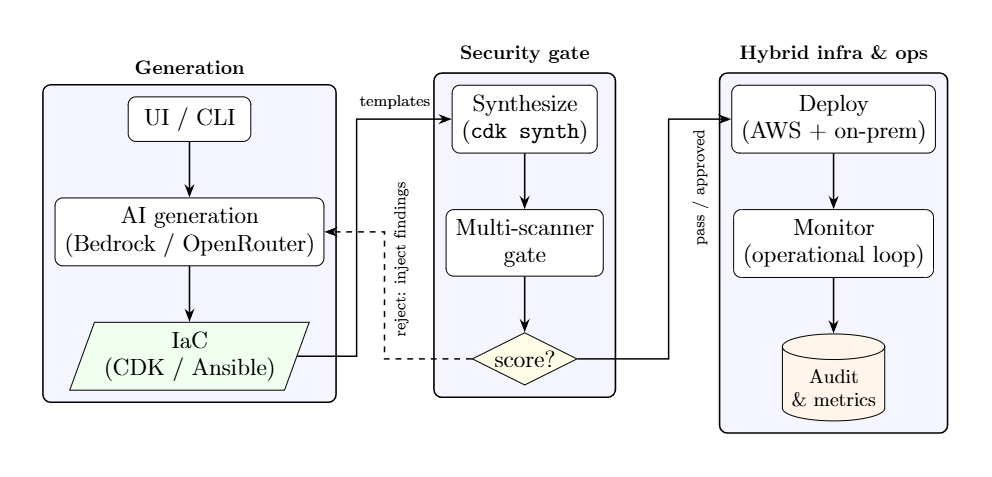
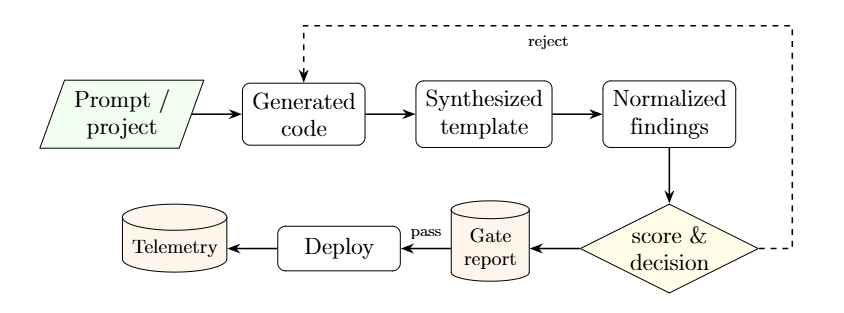

<!-- _class: lead -->
<!-- _paginate: false -->
<!-- _header: '' -->

# Research and Build a SysSecOps System Process for a Hybrid Cloud Environment

**Nguyễn Chính Thông** — 22125102
**Huỳnh Tuấn Minh** — 22125055

Advisors: **PhD. Tran Trung Dung** · **MSc. Chung Thuy Linh**

Advanced Program in Computer Science
University of Science, VNU-HCM — 2026

<!--
0:30. Greet the committee, state the title, introduce both authors and the advisors.
-->

---

## Roadmap

1. **Problem** — why hybrid cloud operations break security
2. **Proposed process** — a SysSecOps workflow with a gate before deploy
3. **Risk engine** — turning many tools into one explainable decision
4. **Prototype** — what was actually built
5. **Results** — three research questions, three bodies of evidence
6. **Limitations & future work**

<!--
0:30. One sentence per bullet. Signal that the evaluation maps 1:1 onto the research questions.
-->

---

## Motivation: hybrid cloud raises the stakes

- Organisations combine **public-cloud elasticity** with **private-infrastructure control**
- Hybrid is now the default operating model, not an edge case
- But the combination **multiplies operational surface**:
  - two provisioning mechanisms, two security models, two identity domains
  - configuration drift and misconfiguration become the dominant failure mode
- Provisioning, administration, delivery and security assessment are typically run by **separate teams with separate tools**

> The flexibility is real — so is the coordination cost.

<!--
0:45. Set up the tension: hybrid buys flexibility and pays in complexity.
-->

---

## Four operational challenges

| | Challenge | Consequence |
|---|---|---|
| **C1** | Managing heterogeneous infrastructure | Inconsistent policy across on-prem, private and public cloud |
| **C2** | Integrating continuous security into the lifecycle | Security applied late → expensive, delayed remediation |
| **C3** | Assessing findings and prioritising risk | Many tools, many formats, no consistent prioritisation |
| **C4** | Establishing an integrated SysSecOps process | SysAdmin / Dev / Sec silos, communication gaps, no traceability |

<!--
0:45. Do not read the table. Name each challenge and give one concrete consequence.
-->

---

## Research gaps in the literature

- **G1 — Limited operational frameworks for hybrid cloud security**
  NIST RA defines *what* the components are, not *how* to operate them together
- **G2 — Continuous security stops at CI/CD**
  Rarely extended across infrastructure operations in heterogeneous environments
- **G3 — Little orchestration of heterogeneous security tools**
  Research categorises tools; far less work consolidates their outputs into one decision
- **G4 — Limited empirical validation of integrated processes**
  Conceptual architectures dominate; executable, evaluated processes are scarce

<span class="small">Myrbakken & Colomo-Palacios (2017) · Rajapakse et al. (2021) · Zhao et al. (2024) · Liu et al. (2011)</span>

<!--
0:45. Anchor each gap to a citation so the framing is not opinion.
-->

---

<!-- ## Gaps → Objectives → Research questions → Contributions

| Gap | Objective | RQ | Contribution |
|---|---|---|---|
| G1, G4 | Design a SysSecOps operational process integrating infra management, assessment, enforcement and deployment | **RQ1** Decision conformance and enforcement correctness | **C1** SysSecOps operational process |
| G2 | Extend continuous security across *both* sides of the hybrid | **RQ2** Cross-boundary enforcement equivalence | **C1 / C3** |
| G3 | Establish a unified security assessment mechanism over heterogeneous tools | **RQ3** Unified risk-evaluation capability | **C2** Unified risk mechanism |
| G4 | Implement and evaluate a prototype | RQ1–RQ3 | **C3** Prototype + evaluation framework | -->

<!--
0:45. This is the logical spine of the thesis. Walk one row end to end, then say the rest follows the same pattern.
-->

<!-- --- -->

## Contributions

**C1 — A SysSecOps operational process for hybrid cloud**
Integrates system administration, continuous security and software delivery into one workflow, with a *common decision path* across public and private targets.

**C2 — A unified security assessment mechanism**
Normalises and deduplicates findings from multiple heterogeneous tools, combines them with cost, live compliance and a learned code-risk signal into one explainable score.

**C3 — A working prototype and reproducible evaluation framework**
End-to-end implementation plus separate acceptance criteria per research question, so a successful command or an intentional rejection is never mistaken for evidence of a broader claim.

<!--
0:30. Say each contribution in one sentence; do not read the paragraph.
-->

---

## Core idea: gate **before** deploy

- The decision is taken on the **synthesized artefact** — the CloudFormation template or the resolved Ansible play — not on the prompt or the high-level source
  → the last representation before any resource exists, and the first point where every resource and property is fully known
- **One engine for the whole hybrid**: identical weights, deduplication rules and thresholds on both sides of the trust boundary

**Design goals:** gate-before-deploy · one engine · graceful degradation · auditability · feedback-driven remediation · observability

<!--
0:45. Emphasise "synthesized artefact" — it is the single most important design decision in the architecture.
-->

---

## Three-zone reference architecture

<!-- | Zone | Name | Responsibility |
|---|---|---|
| **1** | AI + IaC local development | Generate IaC from a prompt; local validation (`cdk synth`, `cdk diff`, `--syntax-check`) |
| **2** | **IaC security gate** | Multi-scanner analysis, cross-source deduplication, risk scoring, deploy decision |
| **3** | Hybrid infrastructure & ops monitoring | Provision AWS + on-prem; publish telemetry; drift / remediation loop |

```
Zone 1 ──templates──▶ Zone 2 ──pass / approved──▶ Zone 3
   ▲                     │
   └──reject: inject findings back into the prompt◀─┘
```

Zones are **loosely coupled**: Zone 1 knows nothing of the scoring rules, Zone 3 knows nothing of how the decision was reached. -->



<!--
0:50. Zone 2 is the contribution. Point out the dashed feedback edge: rejected generated code is regenerated with the findings injected into the next prompt.
-->

---

## End-to-end artefact flow

<!-- ```
prompt / project ──▶ generated code ──▶ synthesized template ──▶ normalized findings
                                                                        │
                          telemetry ◀── deploy ◀── gate report ◀── score & decision
                                                                        │
                              └────────── reject: regenerate ───────────┘
``` -->



**Three stable data contracts hold the system together**

- **Gate report** — `score`, `decision`, `components`, deduplicated `findings`, `scanner_status`
- **Execution result** — every external command returns `{return_code, output}`
- **Gate-decision event** → SSM Parameter Store + EventBridge
<!-- - **Gate-decision event** — `(target, score, decision, timestamp)` → SSM Parameter Store + EventBridge -->

<!--
0:50. Each stage transforms its input into a more concrete representation. The contracts are why the generator, the scanner set and the monitoring stack can evolve independently.
-->

---

## Hybrid deployment topology

- **Public side** — AWS: CDK → CloudFormation (VPC, EC2, S3, RDS), SSM, EventBridge, CloudWatch, CloudTrail, Lambda ops-loop, SNS
- **Private side** — on-premises Linux nodes configured by **Ansible**, registered via **SSM hybrid activation**
- **No public inbound administrative access**: the control plane traverses the encrypted link

**Connectivity is a pluggable concern** — mesh overlay VPN (Tailscale/WireGuard) · AWS Site-to-Site VPN (IPsec) · Direct Connect · Transit Gateway · SSM over public endpoints

> The choice of link changes nothing in the gate, the scoring or the governance behaviour.

<!--
0:45. Stress the portability argument: connectivity is orthogonal to the contribution.
-->

---

<!-- ## Governance and enforcement

- **pass** → auto-deploy · **review** → deployment blocked until an explicit approval record exists · **reject** → not deployed; regenerate or return to the author
- Every decision persisted as an **immutable record with the acting identity** (append-only audit trail)
- **Graceful degradation contract** — a missing scanner binary or absent credential degrades to a well-defined `skipped` status; the gate still produces a decision, and the report records *which* sources actually ran
- Credentials are **never** passed as command-line arguments — resolved through provider chains, injected via the environment -->

<!--
0:45. Note that the "skipped" status is recorded in the report, so a weakly-evidenced decision is visible rather than silent.
-->

<!-- --- -->

<!-- ## Why severity-only scoring is not enough

- **Severity ignores blast radius and cost.** The same open security-group rule on an internet-facing load balancer and on an isolated subnet share a severity label but not an exposure.
- **Every single tool has blind spots.** A policy scanner, a template linter, a cost estimator, a live-compliance service and a code model each see a different slice — relying on one yields systematic false negatives.
- **AI generation shifts the risk profile.** The dominant failure mode is not a novel exploit but a *plausible misconfiguration*, so a learned probability of insecurity is as useful as any single rule. -->

<!--
0:40. This slide justifies why a purpose-built score exists at all instead of reusing CVSS.
-->

<!-- --- -->

## Multi-scanner assessment and normalisation

| Tool | Signal | Dimension |
|---|---|---|
| `cfn-lint` | CloudFormation validity & best practice | misconfiguration |
| Checkov | Policy-as-code findings on templates | misconfiguration |
| `ansible-lint` | Best-practice & security findings on plays | misconfiguration |
| Regex secret scanner | Hard-coded credentials | misconfiguration |
| Infracost | Estimated monthly cost / delta | cost |
| AWS Config | Count of non-compliant live rules | compliance |
| Bandit + Semgrep → logistic regression | P(code is insecure) | code risk |

**Deduplication key:** `(resource_id, template, category)` — colliding findings merge, keeping the highest severity and unioning the source labels.

<!--
0:45. Without deduplication, an issue reported by three tools triples its contribution and can push an acceptable change over a threshold.
-->

---

## The additive risk score

$$
S \;=\; \underbrace{\sum_{f \in F} w(\mathrm{sev}(f))}_{\text{severity}}
\;+\; \underbrace{c(\Delta)}_{\text{cost}}
\;+\; \underbrace{5v}_{\text{compliance}}
\;+\; \underbrace{\mathrm{round}\big(p^{\gamma} \cdot P_{\mathrm{ml}}\big)}_{\text{ML code-risk}}
$$

| Severity | Points | | Decision | Band | Action |
|---|---|---|---|---|---|
| Critical | 20 | | **Pass** | $S \le 20$ | Auto-deploy |
| High | 10 | | **Review** | $21 \le S \le 80$ | Manual approval required |
| Medium | 5 | | **Reject** | $S > 80$ | Do not deploy; regenerate |
| Low | 1 | | | | |

Cost is **banded**, not continuous — this keeps the score stable against estimation noise.
The additive form is what makes the report **explainable**: every point is attributable to a component.

<!--
0:50. Say explicitly: the additive form is a deliberate simplification of a general multi-factor risk model, chosen for transparency and reproducibility.
-->

---

## Machine-learning code-risk component

- **Corpus** — positives from **SecurityEval** (CWE-labelled insecure Python); negatives sampled from maintained projects (`click`, `rich`, `typer`)
- **Features** — 11-dimensional count vector: Bandit severity ×3, Bandit confidence ×3, Semgrep severity ×3, two totals
- **Model** — logistic regression, 80/20 stratified split, standardised features, balanced class weights
- **Inference/training parity** — same analysers, same grouping, **same persisted scaler**
- $p = \max_{k \in \text{files}} \sigma(\mathbf{w}^\top \mathbf{x}_k + b)$ — worst file wins, so one risky file cannot be masked by many benign ones
- Unavailable model or analyser → `skipped`, contributes **0 points**

<span class="small">Scope statement: the model estimates **detector-visible** insecurity, not semantic flaws invisible to Bandit and Semgrep.</span>

<!--
0:45. Volunteer the scope statement. Roughly half of the original SecurityEval samples contain logic errors the analysers cannot see; retaining them capped recall near 0.46.
-->

---

<!-- ## Worked example: traceability in practice

A change with **1 high** + **2 medium** deduplicated findings, a **medium cost band**, **1 non-compliant live rule**, and model output $p = 0$:

$$
S = \underbrace{(10 + 5 + 5)}_{20} + \underbrace{10}_{\text{cost}} + \underbrace{5 \times 1}_{\text{compliance}} + \underbrace{0}_{\text{ML}} = 35
$$

Since $20 < 35 \le 80$ → **review**: routed to a human approver, whose decision enters the audit trail.

The per-component breakdown — severity 20, cost 10, compliance 5, ML 0 — tells the approver that the **open administrative port and the cost increase** dominate, directing remediation precisely instead of handing over an opaque number. -->

<!--
0:40. This is the answer to "why not just use a black-box model?" — the operator can act on the breakdown.
-->

<!-- --- -->

## Prototype

| Module | Responsibility |
|---|---|
| `generation/` | Provider-abstracted code generation (Bedrock / OpenRouter), CDK regeneration loop |
| `security_gate/` | Scanner adapters, deduplication, risk scoring, report assembly |
| `execution/` | Subprocess backbone with a stable result contract |
| `pipeline/` | synth–gate–diff–deploy orchestration, approval audit trail, credentials |
| `monitoring/` | CloudTrail, CloudWatch, ops-loop Lambda, on-prem SSM registration |
| `risk_scoring/` | Training and evaluation of the code-risk model |
| `ui/` · `scripts/` | Streamlit operator console · CLI entry points |

The console and the CLI invoke **the same orchestration logic** — a GUI operation follows the identical generate → assess → approve → deploy sequence.

<!--
0:45. Emphasise the shared orchestration path: the UI cannot bypass the gate.
-->

---

<!-- _class: dense -->

## Evaluation methodology — a pre-registered campaign

| RQ | Method | Measures |
|---|---|---|
| **RQ1** Decision conformance and enforcement correctness | 30 declared scenarios, **106 offline runs**, incl. 10 that remove one scanner | Decision conformance, enforcement invariants, score deltas, stage latency |
| **RQ2** Cross-boundary enforcement equivalence | Same engine on an on-prem Linux node via mesh VPN; **11 catalogued weakness classes** expressed twice, measured before and after remediation | Checkpoint attainment, **detection coverage** across the boundary |
| **RQ3** Unified risk-evaluation capability | Held-out classifier evaluation + controlled boundary cases | Accuracy, P/R/F1, ROC-AUC, score & decision correctness |

- **Declared first.** Scenarios, expected decisions and replicate counts were fixed in a version-controlled specification *before* any reported run executed; every statistic is computed from the persisted records by one analysis program
- **30 calibrated fixtures** — 6 band + **12 matched pairs** (11 weakness classes + 1 compliant *specificity control*). Live pricing and live account state are disabled: in the pilot they moved a *reject* fixture from 114 to 119
- **A security rejection is not a pipeline failure** — a valid *reject* that blocks deployment is *correct* execution. Denominators are reported in place of confidence intervals

<!--
0:45. The methodological point that carries the chapter: the specification came first, so there was no freedom to choose after the fact which runs to count. Flag the deliberate choice of detection coverage over decision equality for RQ2 — you will justify it in two slides' time.
-->

---

<!-- _class: dense -->

## RQ1 — Decision conformance and enforcement correctness

<!-- **106 runs · 30 pre-declared scenarios.** Decision conformance **100 % (106/106)**, and **1.0 for every scenario individually**, so the aggregate hides no scenario that failed consistently. The confusion matrix is **exactly diagonal** (Ansible 26 / 25 / 8, CDK 11 / 28 / 8) — neither a permissive nor an over-blocking tendency. Replicates were identical: all five `cdk-reject-block` runs scored exactly **114**, all five `ans-reject-block` runs exactly **155**. -->

| Enforcement invariant | $n$ | Held | Rate |
|---|---|---|---|
| Run produces a persisted summary | 106 | 106 | 1.00 |
| Gate reports a status for every scanner | 106 | 106 | 1.00 |
| Unapproved *review* halts | 43 | 43 | 1.00 |
| Approved *review* writes an approval record | 10 | 10 | 1.00 |
| *Reject* blocks deployment | 16 | 16 | 1.00 |
| *Reject* writes a rejection record | 16 | 16 | 1.00 |

<!-- **Gate overhead** — median 102.50 s on the cloud branch (69.35 % of run wall-clock) against 7.04 s on-premises (24.80 %); under two minutes on the slower branch. -->

<!--
0:50. Two things to own. First, the denominators are not comparable: 1.00 over ten approved-review runs is a far weaker statement than 1.00 over 106 — read the last four rows as "the mechanism works when exercised", not as a failure-rate estimate. Second, conformance is against a specification the same work authored, so it shows the implementation satisfies its own spec, not that the spec grades real infrastructure correctly.
-->

<!-- ---

## Finding 1 — the additive score fails **open**

Ten scenarios removed exactly one scanner from an otherwise identical run. Every resulting decision matched the arithmetic prediction, so the gate degrades *predictably*. That is precisely the problem. -->

| Component removed | Full | Degraded | Δ | Decision change |
|---|---|---|---|---|
| Checkov (from *review*, CDK) | 54 | 9 | **45** | review → **pass** |
| Checkov (from *reject*, CDK) | 114 | 64 | 50 | reject → review |
| Secret scan (from *reject*, Ansible) | 155 | 75 | **80** | reject → review |
| ML risk model (from *reject*, CDK) | 115 | 70 | 45 | reject → review |
| ML risk model (from *review*, CDK) | 63 | 25 | 38 | review → review |

<!-- **An absent scanner and a scanner that found nothing contribute identically.** The run still reports a clean terminal status. The scanner-status record makes the degradation visible to an auditor afterwards, but nothing in the decision function acts on it — a design deficiency inherent to any purely additive score, not an implementation defect. -->

<!--
0:45. This is a negative result and it is deliberately foregrounded. The gate conformed to its specification on every one of these rows; the specification is what permits a change to be released because the evidence that would have held it was never collected. Chapter 6 proposes an assurance penalty as the remedy — mention that the existing degradation scenarios are already the test cases for it.
-->

---

<!-- _class: dense -->

## RQ2 — Cross-boundary equivalence: checkpoint attainment

<!-- **65 Ansible-branch runs** — 59 offline, plus a 6-run live arm against a disposable Ubuntu 22.04 VM. Attainment counts *attempted* checkpoints only: a *reject* never reaches a dry run, and scoring that as a failure would penalise correct behaviour. -->

| Checkpoint | Offline (59) | Live target (6) |
|---|---|---|
| Target reachability | — | 6/6 |
| Syntax validation | 59/59 | 6/6 |
| Security gate | 59/59 | 6/6 |
| Dry run | 31/31 | 3/3 |
| Apply | — | 3/3 |
| Post-apply verification | — | 3/3 |
| Repeated-run idempotency | — | 3/3 |

<!-- **Nine assertions** read state back off the host — zero failures on every apply; all three repeat applies recorded `changed=0`. All three `ans-reject-deploy-blocked` runs stopped at `ansible.gate` — **no dry run, no apply** — against a live, reachable host. -->

<!--
0:45. The live arm produces three kinds of evidence the offline campaign structurally could not. Stress that verification asserts literal expected values rather than re-reading the fixture's own variables — otherwise a wrong variable would be accepted as correct. Then concede the counts: the last four rows rest on three runs each, against one host from one fresh image.
-->

---

<!-- _class: dense -->

## Finding 2 — one decision function, **unequal detection**

<!-- Decision *equality* is the wrong property to demand: an `iptables` rule is not a security group. The property that matters is weaker — a weakness class the gate can see on one side must not be **invisible** on the other. -->

**11 classes derived from MITRE CWE-1008**, not chosen by the author: 223 members → three mechanical filters → 38 candidates → the 11 expressible as a matched pair. Measured **twice** — at a frozen gate commit, then after remediation.

| Arm | Cloud | On-prem | **Named by both** |
|---|---|---|---|
| **Baseline** | 7/11 | 5/11 | **3/11** |
| **Remediated** — +9 rule families | 10/11 | 11/11 | **10/11** |

Baseline discordance: cloud-only **4** · on-prem-only **2** · neither **2** → a gate treating the branches as interchangeable would be wrong about **8 of 11**

<!-- Where a class *is* named on both sides the **identifiers match** — `sg_ssh_open` whether it came from a security group or an `iptables` task. That shared vocabulary is the substantive result, not the counts. One baseline miss proves the point: the cloud report **did** contain `CKV_AWS_33` "wildcard (*) principal" — the right weakness, in the wrong words, and therefore indistinguishable from silence to every downstream consumer. -->

<!--
0:45. Three things. First, externalising the class list is what makes the baseline credible — the author could not choose the weaknesses the gate already covered. Second, the remediated arm is NOT a recall estimate: it answers "were these gaps closable?", not "how much does the gate see?" Third, one gap was left open deliberately — CWE-922 in the cloud — because a credential in a CDK app sits in general-purpose Python where no regex separates an embedded secret from the idioms that legitimately handle one. Raising the number there would have degraded the tool.
-->

---

## RQ3 — Unified risk-evaluation capability

**Held-out classifier performance** ($n = 324$: 162 negative, 162 positive)

| Accuracy | Precision | Recall | F1 | ROC-AUC |
|---|---|---|---|---|
| **0.9259** | 0.9480 | 0.9012 | 0.9240 | **0.9233** |

| Confusion matrix | Predicted − | Predicted + | | Top coefficients | |
|---|---|---|---|---|---|
| **Actual −** | 146 | 16 | | `bandit_low` | 1.720 |
| **Actual +** | 8 | 154 | | `bandit_conf_high` | 1.656 |
| | | | | `total_bandit` | 1.555 |

**Controlled gate-decision check:** $S=20 \to$ pass · $S=21 \to$ review · $S=80 \to$ review · $S=81 \to$ reject · duplicate finding across tools → **counted once**. All five cases agreed with the specification.

<!--
0:50. The model draws on both analysers, not one. The two false negatives matter operationally: labelled-insecure files that receive a lower learned contribution.
-->

---

<!-- _class: dense -->

## Limitations and threats to validity

1. **Self-authored fixtures, limited scale** — pre-registration removes selection freedom, not the dependency: the gate's own authors wrote the fixtures. Ten approved-review runs, sixteen rejections, three replicates per deployment checkpoint
2. **Narrow deployment-side evidence** — apply, verification and idempotency measured against *one* fresh VM, one OS image: nothing on host heterogeneity, concurrency or partial failure
3. **Restricted implementation scope** — Python + Bandit/Semgrep; AWS CDK/CloudFormation + Ansible. No claim of transfer to other languages, providers or vulnerability classes
4. **Dataset and model validity** — 31 held-out samples from one split; undetectable categories excluded; negatives are *reference secure*, not verified secure
5. **Risk assumptions and the fail-open score** — weights, bands and thresholds uncalibrated; missing evidence is read as low risk
6. **Unequal detection coverage** — a shared decision function over unshared scanner sets. The class list is external, but the fixtures are hand-authored, so the figures bound **rule-to-CWE alignment**, not field recall
7. **Limited comparative measures** — no manual baseline; no operator effort, lead time, change-failure rate or remediation time

<!--
0:45. Deliver confidently and quickly. Items 5 and 6 are the two findings you already presented, so this slide should read as consolidation rather than confession.
-->

---

<!-- _class: dense -->

## Conclusion

- Hybrid cloud fragments provisioning, administration, delivery and security; this work makes **security an explicit, auditable operational decision** inside that lifecycle
- **One process, one engine, both sides** of the hybrid — the same weights, deduplication and thresholds govern a CloudFormation template and an Ansible play
- The **additive score** converts heterogeneous tool output into a single decision *without* losing the per-component explanation
- The pre-registered campaign shows the implemented gate **decides and enforces as specified**: 106/106 conformance, six enforcement invariants at rate 1.00
- It also shows the **specification itself permits a release when evidence is missing**, and that a shared decision function does not by itself produce equal treatment when detection coverage differs
- Those two findings are **as much a result of this work as the conformance figures** — internal correctness under pre-declared conditions, not operational effectiveness at scale

<!--
0:45. Restate the central proposition: security as a decision function, not a post-deployment activity. Then land the honest close — the negative findings define the agenda for further validation.
-->

---

<!-- _class: dense -->

## Future work

1. **Close the fail-open condition** *(first priority)* — make the decision function consume the scanner-status record it already writes: an assurance penalty proportional to missing coverage, or a fail-closed policy forcing *review* below a coverage threshold. The existing degradation scenarios are ready-made test cases
2. **Close the last coverage gap at source** — give the cloud path a secret scan that separates an *embedded* credential from the idioms that legitimately *handle* one (entropy + provider formats, not keywords); give the private path an equivalent learned signal or an explicit *not applicable*; replace the hand-authored fixtures with independently written ones
3. **Broaden deployment-side evidence** — divergent prior state, concurrent targets, induced partial failures, so failure attribution has something other than `none` to classify; independently authored fixtures
4. **Validate the model** — larger multi-project corpus, project-aware partitioning, repeated cross-validation, external holdout, and a retained *challenge set* of analyser-invisible flaws
5. **Calibrate the score** — expert judgement and historical incidents; sensitivity and ablation against severity-only and scanner-only baselines
6. **Extend platform coverage** — more providers, languages and orchestrators; an operator study on whether the breakdown genuinely aids remediation

<!--
0:30. Frame as the concrete agenda the two findings imply, not a wish list. The ordering is the point: items 1 and 2 are repairs to a system that already works, not extensions of it.
-->

---

<!-- _class: lead -->
<!-- _paginate: false -->

# Thank you

## Questions and discussion

**Nguyễn Chính Thông** · **Huỳnh Tuấn Minh**
Advisors: PhD. Tran Trung Dung · MSc. Chung Thuy Linh

<!--
0:15.
-->

---

<!-- Backup slide -->

## Backup — Connectivity options

| Method | Mechanism | Trade-offs |
|---|---|---|
| Mesh overlay VPN (Tailscale/WireGuard) | Userspace WireGuard, NAT traversal, identity ACLs | Fast, no inbound ports; depends on an agent + coordination service |
| AWS Site-to-Site VPN (IPsec) | Managed tunnels to a virtual private / transit gateway | Standards-based; needs a gateway device, bandwidth-limited per tunnel |
| AWS Direct Connect | Dedicated private circuit | Low latency, stable bandwidth; cost and lead time, usually paired with a VPN |
| Transit Gateway / VPN CloudHub | Managed hub-and-spoke routing | Scales multi-site routing; adds a managed tier and cost |
| SSM hybrid activation over public endpoints | Agent reaches SSM endpoints over TLS 443 | Simplest management-plane reach; no private data-plane connectivity |

---

<!-- Backup slide -->

## Backup — Full model coefficients

| Feature | Coefficient | | Feature | Coefficient |
|---|---|---|---|---|
| `total_semgrep` | 1.136296 | | `bandit_high` | 0.435620 |
| `bandit_conf_medium` | 1.003949 | | `bandit_low` | 0.261740 |
| `semgrep_high` | 0.914679 | | `bandit_conf_high` | 0.138912 |
| `semgrep_medium` | 0.720708 | | `bandit_conf_low` | 0.083852 |
| `total_bandit` | 0.610932 | | `semgrep_low` | 0.067123 |
| `bandit_medium` | 0.454592 | | | |

Features were standardised before training, so magnitudes indicate relative influence **within this fitted model**. Total-finding features are mathematically related to the severity counts, introducing correlated predictors — the coefficients describe the model, not causation.

---

<!-- Backup slide -->

## Backup — Dataset construction

- **Positive class** — SecurityEval, CWE-labelled insecure Python, one file per sample, label 1
- **Negative class** — files sampled from `click`, `rich`, `typer`, label 0 (*reference secure*)
- **Filtering** — exclude package initialisers and tests; admit files with 20–700 non-blank, non-comment lines (model corpus narrowed to 20–300 lines to match SecurityEval scale)
- **Exclusion** — vulnerability categories not representable by the configured Bandit/Semgrep features were removed, keeping ≈15 % as hard negatives
- **Effect** — an initial model over the unfiltered corpus reached only ≈0.73 accuracy with recall ≈0.46; the filtered corpus makes the chosen features informative
- **Result** — ≈150 samples, near-balanced; 31-file held-out partition

---

<!-- Backup slide -->

## Backup — Comparison with related approaches

| Approach | Primary emphasis | Relationship to this work |
|---|---|---|
| Traditional operations | Separately coordinated provisioning, administration, review | This work integrates the transitions; no quantitative manual baseline yet |
| NIST Reference Architecture | Vendor-neutral actors and components | Supplies context; this work adds a concrete but less vendor-neutral sequence |
| CloudCAMP | Model-driven generation, less manual scripting | Stronger platform abstraction; this work emphasises gating and traceability |
| Industrial IaC practice | Adoption, integration, maintenance challenges | Normalisation addresses heterogeneous output but creates an adapter layer to maintain |
| Continuous security (ADOC, Rajapakse et al.) | Lifecycle security, tool integration, triage | This work adds hybrid decision control and an explainable quantitative score |
