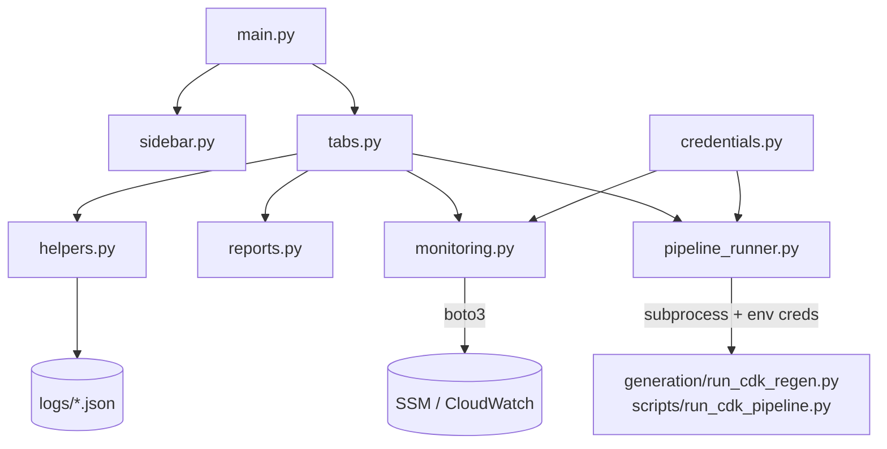

# ui — Streamlit Operator Console

## Purpose

`ui/` is a modular Streamlit application that drives the full pipeline end-to-end from a
browser: **Login → Generate + Gate → Review & Edit → Decision → Deploy → Monitor**. It is a
thin orchestration layer — every privileged action is delegated to the CLI scripts
(`generation/run_cdk_regen.py`, `scripts/run_cdk_pipeline.py`) launched as subprocesses with
credentials injected as environment variables (never as CLI arguments).

## Run

```bash
.venv/bin/python -m streamlit run ui/main.py
# or the backward-compatible shim:
.venv/bin/python -m streamlit run ui_app.py
```

> Use the project virtualenv — system Python lacks Streamlit. `streamlit` is in
> [`../requirements.txt`](../requirements.txt).

## Files

| File | Role |
|---|---|
| `__init__.py` | Package marker |
| `main.py` | `set_page_config`, session-state init, renders sidebar + 6 tabs |
| `config.py` | Paths, credential locations, color maps, return-code map, monitoring constants |
| `credentials.py` | Load / test / save AWS (`~/.aws`) + OpenRouter (`.env`) credentials |
| `sidebar.py` | Provider/model/region/scanner settings panel → settings dict |
| `helpers.py` | Gate-report + approval/rejection discovery and loading |
| `projects.py` | Multi-project / multi-workflow registry persisted in `logs/projects.json`; isolates each project's artifacts under `logs/projects/<id>/` and selects the `cdk` or `hybrid` workflow |
| `pipeline_runner.py` | Subprocess orchestration for generate / synth-gate / deploy (exports the active project's log dir via `SYSSECOPS_LOG_DIR`) |
| `monitoring.py` | AWS-backed reads: SSM gate state, CloudWatch alarms, metric averages |
| `reports.py` | Renders gate report + decision banner |
| `tabs.py` | All six tabs and the four Pipeline sub-tabs |
| `../ui_app.py` | Shim that calls `ui.main.main()` |



---

## `config.py` — Configuration

Single source of truth for the UI. Path constants resolve from the repo root:
`GENERATED_CDK_APP`, `LOGS_DIR`, `GATE_REPORTS_DIR`, `CDK_REGEN_DIR`, `APPROVALS_DIR`,
`REJECTIONS_DIR`, `AWS_CREDS_PATH`, `AWS_CONFIG_PATH`, `ENV_FILE`, `REGEN_SCRIPT`,
`PIPELINE_SCRIPT`, `README_FILE`.

- **Defaults:** `DEFAULT_REGION="ap-southeast-2"`, `PROVIDERS=["bedrock","openrouter"]`,
  `GATE_PASS_MAX=20`, `GATE_REVIEW_MAX=80`.
- **Color/style maps:** `DECISION_STYLE`, `RISK_COLOR`, `SEVERITY_COLOR`, `ALARM_STATE_STYLE`.
- **`RETURN_CODE_MEANING`** maps pipeline exit codes to human text (0/2/3/9/10/11/12/21/22).
- **Monitoring constants:** `CLOUDWATCH_NAMESPACE="SysSecOps/Gate"`,
  `SSM_GATE_PREFIX="/syssecops/gate"`, `ALARM_NAME_PREFIX="syssecops"`,
  `SCANNERS=["checkov","cfn-lint","infracost"]`.

---

## `credentials.py` — Credential Management

| Function | Purpose |
|---|---|
| `load_credentials()` | Reads stored creds → `{access_key, secret_key, session_token, region, openrouter_key}` |
| `save_aws_credentials(...)` | Writes `~/.aws/credentials` + `~/.aws/config` (chmod 600) |
| `save_openrouter_key(api_key)` | Writes `OPENROUTER_API_KEY` to `.env` |
| `test_aws_credentials(...)` | STS `GetCallerIdentity` → `(ok, arn_or_error)` |
| `test_openrouter_key(api_key)` | `GET /models` on OpenRouter → `(ok, message)` |

Credentials are saved to standard locations so subprocesses pick them up via boto3's
default chain.

---

## `pipeline_runner.py` — Subprocess Orchestration

| Function | Invokes |
|---|---|
| `make_run_id()` | Generates `cdk_<ISO8601>Z` |
| `stream_subprocess(args, on_line)` | Runs from repo root, merges stdout/stderr, streams per line |
| `run_generate_stage(settings, prompt, on_line)` | `generation/run_cdk_regen.py --prompt … --provider … --max-attempts … --run-id …` |
| `run_synth_gate_stage(settings, on_line)` | `scripts/run_cdk_pipeline.py --project-dir … --run-id … [--no-*]` (no deploy) |
| `run_deploy_stage(approve_run_id, manual_approve, on_line)` | `scripts/run_cdk_pipeline.py --approve-run-id … --deploy [--manual-approve]` |

Credentials are injected into the child process env (`AWS_*`, `OPENROUTER_API_KEY`,
`PYTHONUNBUFFERED=1`) — never passed as CLI arguments.

> **Important:** `--approve-run-id` is the *gate report's own* run_id (the regen loop appends
> `_a<N>`), not the UI run_id.

---

## `monitoring.py` — Live AWS Status

| Function | Purpose |
|---|---|
| `list_stack_statuses()` | SSM `/syssecops/gate/...` → `[{stack, score, decision, run_id}]` |
| `list_alarms()` | CloudWatch alarms prefixed `syssecops` → `[{name, state, metric, updated}]` |
| `get_gate_metric_average(metric, hours=168)` | Average of a `SysSecOps/Gate` metric over N hours |

All functions degrade gracefully — they return `([], error)` when credentials are missing
or boto3 is unavailable.

---

## `tabs.py` — Tabs & Workflow

Six top tabs:

1. **🔑 Login** — enter/validate/store AWS + OpenRouter credentials.
2. **🚀 Pipeline** — four sub-tabs:
   1. *Generate + Gate* — prompt → `run_generate_stage`.
   2. *Review & Edit* — edit `generated_cdk/app.py`, re-run synth+gate (`run_synth_gate_stage`).
   3. *Decision* — render PASS/REVIEW/REJECT banner + findings.
   4. *Deploy* — approve (review band needs a confirm checkbox) → `run_deploy_stage`.
   A shared *active run bar* shows run_id/decision/score, a Reset button, and a "load existing
   run" expander.
3. **📂 Results** — browse historical gate reports from `logs/gate_reports/`.
4. **🛡️ Security** — aggregate stats: pass/review/reject rates, top recurring findings, trends.
5. **📡 Monitor** — local history (score trend, approvals, rejections) + live AWS section
   (SSM state, CloudWatch alarms) with auto-refresh (15/30/60/120s).
6. **⚙️ Settings** — effective settings, credential paths, tool availability (`checkov`,
   `cfn-lint`, `infracost`, `cdk`), and the project README.

Pipeline state is held in `st.session_state` (keys prefixed `pipeline_*`). Because the
Pipeline sub-tabs render all bodies on every run, transient `*_running` flags drive the
in-place runners and each ends with `st.rerun()`. When code is set programmatically, the
`pipeline_code_editor` widget key is popped so the text area refreshes.

---

## Module Interconnections

`main.py` initializes session state and renders the sidebar + tabs. `tabs.py` delegates
generation/deploy to `pipeline_runner.py`, report rendering to `reports.py`, live status to
`monitoring.py`, and disk discovery to `helpers.py`. `config.py` has no dependencies and is
imported everywhere.

See [`../THESIS_REPORT.md`](../THESIS_REPORT.md) for the role of the UI in the overall system.
